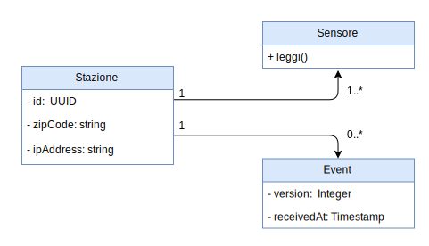
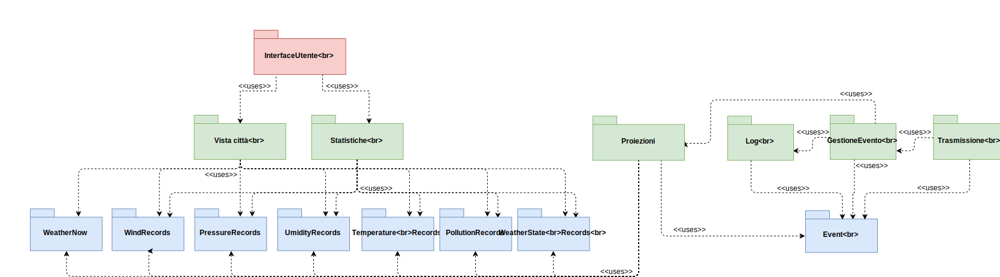
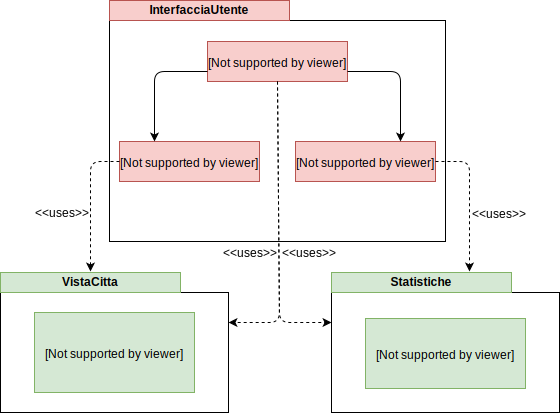
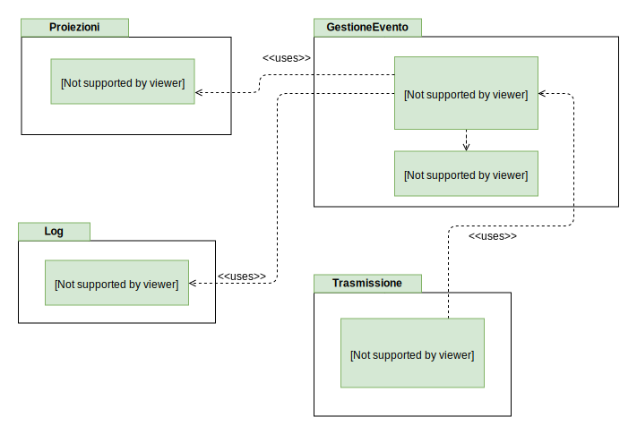
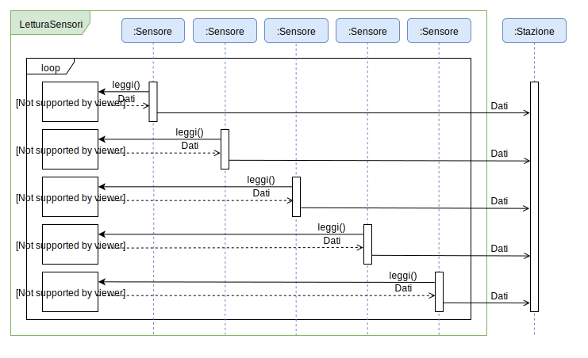
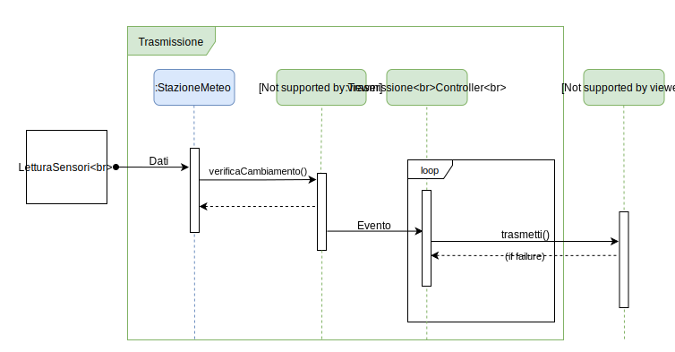
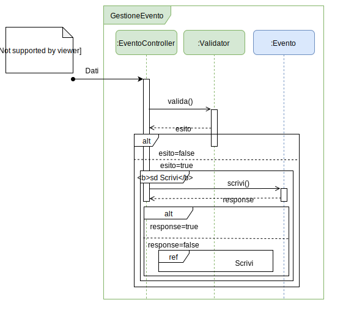
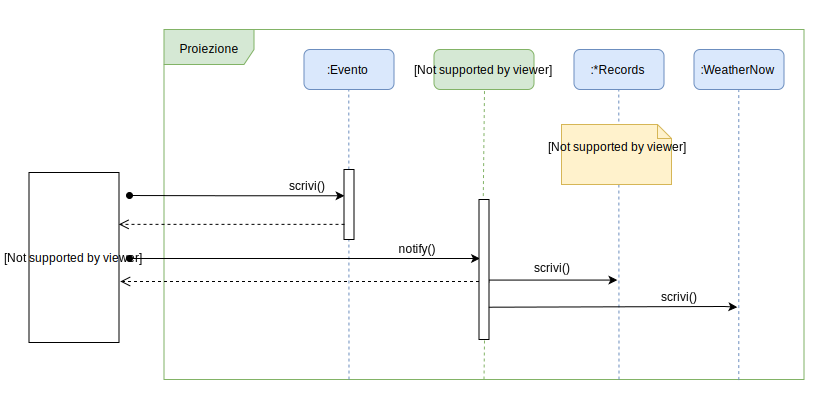

## Creazione modello del dominio

Direction: N; NNE; NE; ENE; E; ESE; SE; SSE; S; SSO; SO; OSO; O; ONO; NO; NNO

State: SUNNY; CLOUDY; RAINY; SNOWY

## Architettura logica

### Struttura

#### Diagramma dei package

#### Diagramma delle classi

### Interazione

