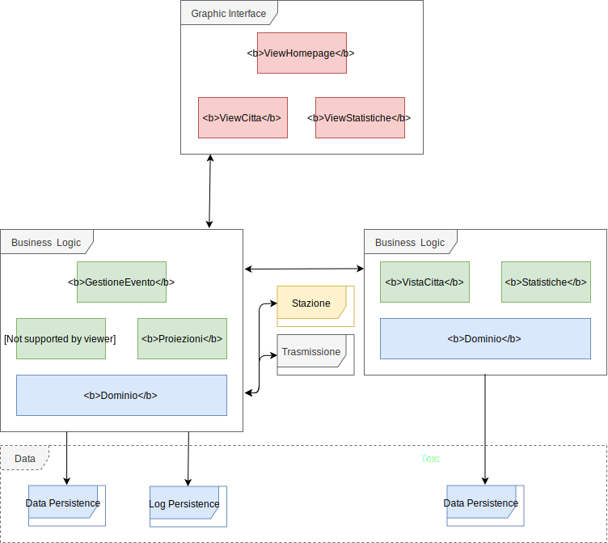

## Progettazione architetturale

### Requisiti non funzionali

Dall'analisi dei requisiti non funzionali sono emersi i seguenti requisiti:
-   Efficienza scrittura
-   Efficienza stazione meteo	
-   Integrità
-   Rapidità di ricerca	
-   Semplicità ed immediatezza nell'utilizzo
-   Velocità di lettura
-   Velocità validazione

L'efficienza del sistema è estremamente importante nonchè il suo punto di forza; avendo una grande mole di dati da ricevere e processare, è necessario garantire delle performance elevate per poter permetterne la fluidità.  Essendo il sistema in grado di determinare quando un evento si è verificato, la quantità di dati trasmessa sulla rete può essere ridotta al minimo indispensabile. La comunicazione può anche avvenire in maniera più rapida a discapito della sicurezza e dell'integrità del dato, in quanto esso stesso non è sensibile e non necessita una forte protezione. Per quanto riguarda la rapidità di ricerca, anch'esso è un requisito abbastanza importante per permettere una fruizione rapida ed efficace da parte dell'utente. Il sistema inoltre deve riuscire a validare gli eventi letti dai sensori senza fare da *collo di bottiglia* alle prestazioni generali.  Per garantire una buona performance a livello di persistenza, e per permettere l'utilizzo di alcune funzioni che riducono i tempi di sviluppo software (in quanto già predisposto), viene utilizzato un database *PostgreSQL* che permette l'invio asincrono di funzioni di notifica tra vari componenti del sistema.  La stazione meteo non è legata ad uno specifico hardware, così come i sensori non sono necessariamente ristretti a quelli descritti nell'analisi dei requisiti; data la flessibilità del sistema è possibile in versioni future aggiungere facilmente nuovi tipi di sensori e di dati letti.

### Scelta dell'architettura

Il sistema prevede un'architettura client/server a tre livelli, distribuita su più server e su più layer di persistenza. Si utilizzano diversi pattern architetturali: il primo, per la ricezione, registrazione e gestione degli eventi è un *event driven architecture*, mentre nella seconda parte client/server viene utilizzato un pattern MVP (Model View Presenter).

Un utente (client) può connettersi ad un servitore tramite l'utilizzo del protocollo http, dato che sulla piattaforma non vi sono dati sensibili da proteggere. Inoltre la fruizione dei dati non è vincolata ad una fase di autenticazione, infatti l'utente può accedere liberamente a tutti i contenuti che il sito mette a disposizione.

Il server delegato alla gestione degli eventi comunica in modo sicuro tramite l'utilizzo di TLS con la stazione meteo, per evitare possibili casi di attacco esterno e non è direttamente accessibile dall'utente finale.   Il server delle proiezioni invece comunica tramite chiamate http con il cliente, inviando i dati che si vogliono visualizzare letti direttamente dal layer di persistenza.

Il sistema si basa su più database , la persistenza avviene su di un database postgreSQL, adibito alla sola scrittura dei dati provenienti dalle diverse stazioni.
Gli altri database sono generati a partire dalle proiezioni del dato per consentire una maggiore facilità di utilizzo nella fase di aggregazione.

#### Architettura del sistema:

