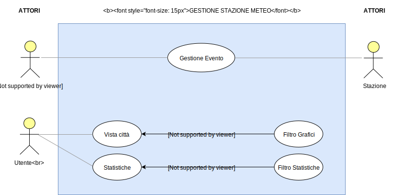

# WeatherMent.IO
## Membri del team (Gruppo 38):
-   Alessandro Foglia (0000801918)
-   Mattia Forcellese (0000788898)
-   Federico Pomponii (0000803024)
  

- [WeatherMent.IO](#weathermentio)
  - [Membri del team (Gruppo 38):](#membri-del-team-gruppo-38)
- [Abstract](#abstract)
  - [Descrizione del progetto](#descrizione-del-progetto)
- [Analisi dei requisiti](#analisi-dei-requisiti)
  - [Requisiti del sistema](#requisiti-del-sistema)
  - [Analisi del dominio](#analisi-del-dominio)
  - [Analisi dei requisiti](#analisi-dei-requisiti-1)
    - [Casi D'uso](#casi-duso)
  - [Analisi del rischio](#analisi-del-rischio)
  - [Interfacce grafiche](#interfacce-grafiche)
    - [HOMEPAGE](#homepage)
    - [PAGINA SPECIFICA DELLA LOCALITA'](#pagina-specifica-della-localita)
- [Analisi del problema](#analisi-del-problema)
  - [Modello del dominio](#modello-del-dominio)
  - [Architettura logica](#architettura-logica)
    - [Struttura](#struttura)
    - [Interazione](#interazione)
    - [Comportamento](#comportamento)

# Abstract
## Descrizione del progetto

WeatherMent.IO nasce con l'idea di creare un database con informazioni raccolte da diverse stazioni metereologiche.

Il progetto è strutturato in modo tale da permettere la consultazione e visualizzazione dei dati grazie ad una interfaccia web che espone all'utente finale grafici dettagliati di dati relativi ad un preciso luogo ed in base a determinati intervalli temporali.

L'architettura è quella di un sistema ad eventi, distruibuito su diversi server e database per avere una maggiore efficienza, scalabilità e affidabilità.
Nello specifico i dati finali esposti all'utente sono organizzati rispetto all'evento che rappresentano su database documentali, mentre quelli raccolti direttamente dalle stazioni vengono processati ed immagazzinati da un server dedicato, che si appoggia invece su di un database relazionale. In questo modo viene garantita una maggiore efficienza su grandi quantità di informazioni, in quanto principali operazioni di lettura e scrittura avvengono in modo del tutto scorrelato.

Il progetto mira ad essere facilmente scalabile sia orizzontalmente che verticalmente ed espandibile sia dal punto di vista di nuove stazioni che di nuovi tipi di dato. Le nuove stazioni meteo prima di poter trasmettere i dati dovranno essere autenticate per garantire l'affidabilità del sistema. 

# Analisi dei requisiti

## Requisiti del sistema
ID  | Requisito | Tipo
-|-|-
F.1 | La stazione invia i dati al server solo quando avvengono cambiamenti nei valori letti dai sensori; così facendo non si generano eventi ridondanti.  | Funzionale
F.2 | Nel momento in cui si genera un evento da inviare al server, la stazione provvederà a determinare la sua posizione e aggiungerà nazione e ZIP Code prima di inoltrarlo. | Funzionale
F.3 | I dati raccolti dalle stazioni vengono validati dal server prima dell'inserimento sul database, assicurandone la correttezza all'utente finale. | Funzionale
F.4 | Attraverso il client è possibile visualizzare i dati in tempo reale, in un intervallo di tempo definito dall'utente o visualizzare lo storico di una stazione. | Funzionale
F.5 | L'interfaccia web deve permettere la consultazione attraverso filtri e criteri di ricerca. | Funzionale
F.6 | L'interfaccia web deve permettere la consultazione di grafici riassuntivi. | Funzionale
F.7 | Ogni evento generato dalla stazione meteo appartiene ad uno specifico topic. | Funzionale
F.8 | Per ogni topic ci sono determinati tipi di evento. | Funzionale
F.9 | Per ogni tipo di evento è definito un preciso schema che il payload deve rispettare. | Funzionale
F.10 | Ogni volta che viene aggiunto un evento sul database si notifica ai server in ascolto. | Funzionale 
N.1 | Le frequenze di campionamento dei vari sensori possono variare a seconda del modello. | Non Funzionale
N.2 | Le nuove stazioni meteo prima di poter trasmettere i dati dovranno essere autenticate per garantire l'affidabilità del sistema. | Non Funzionale
D.1 | La temperatura inviata dai sensori deve essere misurata in *gradi Celsius (°C)*. | Dominio
D.2 | La pressione inviata dai sensori deve essere misurata in *ettopascal (hPa)*. | Dominio
D.3 | La velocità del vento inviata dai sensori deve essere misurata in *chilometri orari (km/h)*. | Dominio
D.4 | L'umidità inviata dai sensori deve essere misurata in *percentuale (%)*. | Dominio
D.5 | La quantità di *CO*$_2$ inviata dai sensori deve essere misurata in *parti per milione (ppm)*. | Dominio 

## Analisi del dominio
`QUI INSERIRE VOCABOLI E UTILIZZO DI SOFTWARE DA TERZE PARTI`

## Analisi dei requisiti

### Casi D'uso

La stazione è considerata un attore in quanto è un sistema esterno con un ruolo attivo. Interviene nell’applicativo generando continuamente dati in ingresso che verranno utilizzati da Gestione Eventi solo nel caso in cui vengano rilevati dei cambiamenti.

L’utente ha la possibilità di consultare lo Storico di tutti i dati meteo e le Statistiche. Entrambe le schermate dispongono di appositi filtri per la consultaizone.

<table>
<thead><h3>Scenari d'uso</h3></thead>
<tr><td><b>Titolo</b></td> <td>Gestione Evento</td></tr>
<tr><td><b>Descrizione</b></td><td>Lettura dati dalla stazione meteo, validazione dei dati, scrittura su sistema</td></tr>
<tr><td><b>Attori</b></td><td>Evento, Stazione Meteo</td></tr>
<tr><td><b>Relazioni</b></td> <td></td></tr>
<tr><td><b>Precondizioni</b></td> <td>Si è verificato un evento registrato dalla stazione meteo (i.e. un cambio di temperatura, di pressione atmosferica etc)</td></tr>
<tr><td><b>Postcondizioni</b></td><td>Il sistema ha rilevato l'evento, controllato la sua validità e scritto in maniera persistente sul sistema</td></tr>
<tr><td><b>Scenario principale</b></td><td><li style="list-style-type: decimal;"> La stazione meteo invia i dati dell'evento a Gestione Evento <li style="list-style-type: decimal;"> Gestione Evento controlla che l'evento ricevuto sia valido secondo uno schema preciso, definito internamente al sistema<li style="list-style-type: decimal;">Gestione Evento registra in maniera persistente l'evento sul sistema<li style="list-style-type: decimal;">Il sistema prosegue la sua normale esecuzione, in attesa di ricevere altri eventi</td></tr>
<tr><td><b>Scenari alternativi</b> </td><td>La connessione con la stazione meteo viene persa o è molto lenta: <li style="list-style-type: decimal;">La stazione meteo nel caso in cui il server smetta di rispondere riempie un buffer<li style="list-style-type: decimal;">Appena il server torna a rispondere la stazione svuota il buffer inviando gli eventi memorizzati<li style="list-style-type: decimal;">La stazione meteo elimina localmente in via definitiva l'evento solo ed esclusivamente se il server ne conferma la ricezione, per evitare una perdita di eventi</td></tr>
<tr><td><b>Requisiti non funzionali</b></td><td>Integrità dei dati letti dal sensore   Velocità nella validazione dell'evento   Efficienza nella scrittura persisente sul sistema   Efficienza della stazione meteo nell'invio dei dati e nell'utilizzo di memoria cache</td></tr>
</table>

<table>
<tr><td><b>Titolo</b></td> <td>Storico</td></tr>
<tr><td><b>Descrizione</b></td><td>Il sistema permette all'utente di visualizzare l'elenco degli eventi registrati</td></tr>
<tr><td><b>Attori</b></td><td>Utente</td></tr>
<tr><td><b>Relazioni</b></td> <td>Filtro Grafici</td></tr>
<tr><td><b>Precondizioni</b></td> <td></td></tr>
<tr><td><b>Postcondizioni</b></td><td>Il sistema ha mostrato all'utente gli eventi registrati</td></tr>
<tr><td><b>Scenario principale</b></td><td><li style="list-style-type: decimal;"> L'utente ricerca la città di cui vuole visualizzare i dati<li style="list-style-type: decimal;"> Viene mostrata una schermata contenente tutti gli eventi relativi a quella città (registrati in base al cap della stazione meteo)<li style="list-style-type: decimal;">L'utente può decidere di filtrare attraverso Filtro Grafici per decidere la visualizzazione secondo criteri di tempo e di dato</td></tr>
<tr><td><b>Scenari alternativi</b> </td><td>La città ricercata non ha eventi: <li style="list-style-type: decimal;">Il sistema notifica all'utente e ridireziona alla schermata di ricerca</td></tr>
<tr><td><b>Requisiti non funzionali</b></td><td>Semplicità nell'utilizzo e immediatezza nella lettura</td></tr>
</table>

<table>
<tr><td><b>Titolo</b></td> <td>Filtro Grafici</td></tr>
<tr><td><b>Descrizione</b></td><td>Il sistema permette all'utente di filtrare gli eventi da visualizzare</td></tr>
<tr><td><b>Attori</b></td><td>Utente</td></tr>
<tr><td><b>Relazioni</b></td> <td>Storico</td></tr>
<tr><td><b>Precondizioni</b></td> <td></td></tr>
<tr><td><b>Postcondizioni</b></td><td>Il sistema ha mostrato all'utente gli eventi registrati filtrati a seconda dei criteri specificati</td></tr>
<tr><td><b>Scenario principale</b></td><td><li style="list-style-type: decimal;">L'utente imposta i criteri secondo cui filtrare gli eventi: temporali, oppure legati al dato da visualizzare: pressione, inquinamento aria, temperatura, vento e l'umidità<li style="list-style-type: decimal;">Il sistema effettua la ricerca e mostra all'utente gli eventi risultanti</td></tr>
<tr><td><b>Scenari alternativi</b> </td><td>La ricerca effettuata non ha eventi: <li style="list-style-type: decimal;">Il sistema notifica all'utente</td></tr>
<tr><td><b>Requisiti non funzionali</b></td><td></td></tr>
</table>

## Analisi del rischio
-   `TABELLA VALUTAZIONE DEI BENI`
-   `TABELA DELLE MINACCE/CONTROLLI`
-   `ANALISI TECNOLOGICA DELLA SICUREZZA`
-   `SECURITY USE CASE E MISUSE CASE CON RELATIVI SCENARI`

## Interfacce grafiche
### HOMEPAGE
-   Lista ultimi 10 rilevamenti. La tabella avrà i seguenti valori:
    -   Nome località
    -   Temperatura
    -   Umidità
    -   Pressione
    -   Velocita' del vento
    -   Data

- Alla pressione di un valore della tabella si andrà nella pagina specifica della località (
 `GLI ENDPOINT SARANNO DEFINITI DOPO`)

 - `ALTRI DATI EVENTUALMENTE LI AGGIUNGIAMO DOPO`
  
-   Barra di ricerca

### PAGINA SPECIFICA DELLA LOCALITA'
-   Nome località
-   Tutti i valori che il sensore ha avviato
-   Stream in tempo reale con i valori ricevuti
-   `Possibilità di modellare i dati secondi diversi criteri quali data e/o altri`

# Analisi del problema
`ANALISI DOCUMENTO DEI REQUISITI: ANALISI DELLE FUNZIONALITÀ`

## Modello del dominio

## Architettura logica

### Struttura

### Interazione

### Comportamento

