

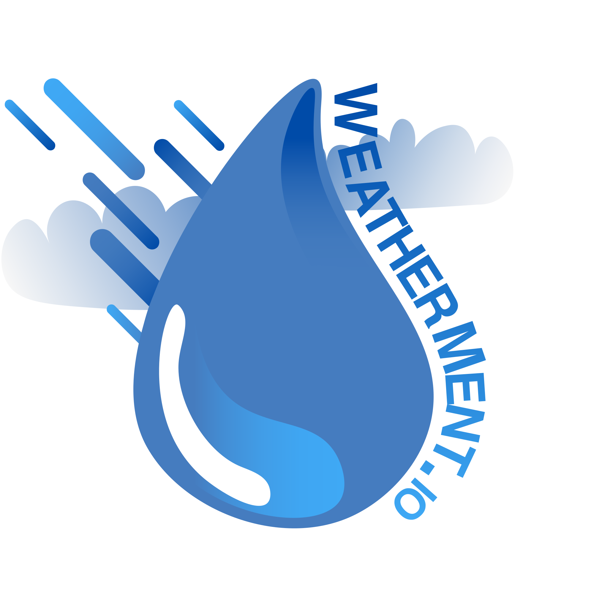

## Membri del team (Gruppo 38):
-   Alessandro Foglia (0000801918)
-   Mattia Forcellese (0000788898)
-   Federico Pomponii (0000803024)
  

<table id="indice">
<thead> <h1><b>INDICE</b></h1></thead>
<tr><td><b><a href=#abstract>Abstract</a></b></td><td class="right"> pag. 1 </td></tr>
<tr><td>&nbsp;&nbsp;&nbsp;&nbsp;&nbsp;&nbsp;&nbsp;&nbsp;<a href="#descrizione-del-progetto">Descrizione del progetto</a></td><td class="right"> pag. 1 </td></tr>
<tr><td><b><a href=#analisi-dei-requisiti>Analisi dei requisiti</a></b></td><td class="right"> pag. 1 </td></tr>
<tr><td>&nbsp;&nbsp;&nbsp;&nbsp;&nbsp;&nbsp;&nbsp;&nbsp;<a href="#requisiti-del-sistema">Requisiti del sistema</a></td><td class="right"> pag. 1 </td></tr>
<tr><td>&nbsp;&nbsp;&nbsp;&nbsp;&nbsp;&nbsp;&nbsp;&nbsp;<a href="#analisi-del-dominio">Analisi del dominio</a></td><td class="right"> pag. 1 </td></tr>
<tr><td>&nbsp;&nbsp;&nbsp;&nbsp;&nbsp;&nbsp;&nbsp;&nbsp;&nbsp;&nbsp;&nbsp;&nbsp;&nbsp;&nbsp;&nbsp;&nbsp;<a href="#vocabolario">Vocabolario</a></td><td class="right"> pag. 1 </td></tr>
<tr><td>&nbsp;&nbsp;&nbsp;&nbsp;&nbsp;&nbsp;&nbsp;&nbsp;<a href="#analisi-dei-requisiti-1">Analisi dei requisiti</a></td><td class="right"> pag. 1 </td></tr>
<tr><td>&nbsp;&nbsp;&nbsp;&nbsp;&nbsp;&nbsp;&nbsp;&nbsp;&nbsp;&nbsp;&nbsp;&nbsp;&nbsp;&nbsp;&nbsp;&nbsp;<a href="#casi-duso">Casi d'uso</a></td><td class="right"> pag. 1 </td></tr>
<tr><td>&nbsp;&nbsp;&nbsp;&nbsp;&nbsp;&nbsp;&nbsp;&nbsp;<a href="#analisi-del-rischio">Analisi del rischio</a></td><td class="right"> pag. 1 </td></tr>
<tr><td>&nbsp;&nbsp;&nbsp;&nbsp;&nbsp;&nbsp;&nbsp;&nbsp;&nbsp;&nbsp;&nbsp;&nbsp;&nbsp;&nbsp;&nbsp;&nbsp;<a href="#valutazione-dei-beni">Valutazione dei beni</a></td><td class="right"> pag. 1 </td></tr>
<tr><td>&nbsp;&nbsp;&nbsp;&nbsp;&nbsp;&nbsp;&nbsp;&nbsp;&nbsp;&nbsp;&nbsp;&nbsp;&nbsp;&nbsp;&nbsp;&nbsp;<a href="#analisi-minacce-e-controlli">Analisi minacce e controlli</a></td><td class="right"> pag. 1 </td></tr>
<tr><td>&nbsp;&nbsp;&nbsp;&nbsp;&nbsp;&nbsp;&nbsp;&nbsp;&nbsp;&nbsp;&nbsp;&nbsp;&nbsp;&nbsp;&nbsp;&nbsp;<a href="#analisi-della-tecnologia-dal-punto-di-vista-della-sicurezza">Analisi della tecnologia dal punto di vista della sicurezza</a></td><td class="right"> pag. 1 </td></tr>
<tr><td>&nbsp;&nbsp;&nbsp;&nbsp;&nbsp;&nbsp;&nbsp;&nbsp;&nbsp;&nbsp;&nbsp;&nbsp;&nbsp;&nbsp;&nbsp;&nbsp;<a href="#security-use-case-e-misuse-case">Security use case e Misuse case</a></td><td class="right"> pag. 1 </td></tr>
<tr><td>&nbsp;&nbsp;&nbsp;&nbsp;&nbsp;&nbsp;&nbsp;&nbsp;&nbsp;&nbsp;&nbsp;&nbsp;&nbsp;&nbsp;&nbsp;&nbsp;<a href="#requisiti-di-protezione">Requisiti di protezione</a></td><td class="right"> pag. 1 </td></tr>
<tr><td>&nbsp;&nbsp;&nbsp;&nbsp;&nbsp;&nbsp;&nbsp;&nbsp;<a href="#interfacce-grafiche">Interfacce grafiche</a></td><td class="right"> pag. 1 </td></tr>
<tr><td>&nbsp;&nbsp;&nbsp;&nbsp;&nbsp;&nbsp;&nbsp;&nbsp;&nbsp;&nbsp;&nbsp;&nbsp;&nbsp;&nbsp;&nbsp;&nbsp;<a href="#struttura">Struttura</a></td><td class="right"> pag. 1 </td></tr>
<tr><td>&nbsp;&nbsp;&nbsp;&nbsp;&nbsp;&nbsp;&nbsp;&nbsp;&nbsp;&nbsp;&nbsp;&nbsp;&nbsp;&nbsp;&nbsp;&nbsp;<a href="#homepage">Homepage</a></td><td class="right"> pag. 1 </td></tr>
<tr><td>&nbsp;&nbsp;&nbsp;&nbsp;&nbsp;&nbsp;&nbsp;&nbsp;&nbsp;&nbsp;&nbsp;&nbsp;&nbsp;&nbsp;&nbsp;&nbsp;<a href="#vista-citt%C3%A0">Vista città</a></td><td class="right"> pag. 1 </td></tr>
<tr><td><b><a href=#analisi-del-problema>Analisi del problema</a></b></td><td class="right"> pag. 1 </td></tr>
<tr><td>&nbsp;&nbsp;&nbsp;&nbsp;&nbsp;&nbsp;&nbsp;&nbsp;<a href="#analisi-del-documento-dei-requisiti">Analisi del documento dei requisiti</a></td><td class="right"> pag. 1 </td></tr>
<tr><td>&nbsp;&nbsp;&nbsp;&nbsp;&nbsp;&nbsp;&nbsp;&nbsp;&nbsp;&nbsp;&nbsp;&nbsp;&nbsp;&nbsp;&nbsp;&nbsp;<a href="#analisi-delle-funzionalit%C3%A0">Analisi delle funzionalità</a></td><td class="right"> pag. 1 </td></tr>
<tr><td>&nbsp;&nbsp;&nbsp;&nbsp;&nbsp;&nbsp;&nbsp;&nbsp;&nbsp;&nbsp;&nbsp;&nbsp;&nbsp;&nbsp;&nbsp;&nbsp;<a href="#analisi-dei-vincoli">Analisi dei vincoli</a></td><td class="right"> pag. 1 </td></tr>
<tr><td>&nbsp;&nbsp;&nbsp;&nbsp;&nbsp;&nbsp;&nbsp;&nbsp;&nbsp;&nbsp;&nbsp;&nbsp;&nbsp;&nbsp;&nbsp;&nbsp;<a href="#analisi-delle-interazioni">Analisi delle interazioni</a></td><td class="right"> pag. 1 </td></tr>
<tr><td>&nbsp;&nbsp;&nbsp;&nbsp;&nbsp;&nbsp;&nbsp;&nbsp;<a href="#analisi-dei-ruoli-e-delle-responsabilit%C3%A0">Analisi dei ruoli e delle responsabilità</a></td><td class="right"> pag. 1 </td></tr>
<tr><td>&nbsp;&nbsp;&nbsp;&nbsp;&nbsp;&nbsp;&nbsp;&nbsp;<a href="#creazione-modello-del-dominio">Creazione modello del dominio</a></td><td class="right"> pag. 1 </td></tr>
<tr><td>&nbsp;&nbsp;&nbsp;&nbsp;&nbsp;&nbsp;&nbsp;&nbsp;<a href="#architettura-logica">Architettura logica</a></td><td class="right"> pag. 1 </td></tr>
<tr><td>&nbsp;&nbsp;&nbsp;&nbsp;&nbsp;&nbsp;&nbsp;&nbsp;&nbsp;&nbsp;&nbsp;&nbsp;&nbsp;&nbsp;&nbsp;&nbsp;<a href="#struttura-1">Struttura</a></td><td class="right"> pag. 1 </td></tr>
<tr><td>&nbsp;&nbsp;&nbsp;&nbsp;&nbsp;&nbsp;&nbsp;&nbsp;&nbsp;&nbsp;&nbsp;&nbsp;&nbsp;&nbsp;&nbsp;&nbsp;&nbsp;&nbsp;&nbsp;&nbsp;&nbsp;&nbsp;&nbsp;&nbsp;<a href="#diagramma-dei-package">Diagramma dei package</a></td><td class="right"> pag. 1 </td></tr>
<tr><td>&nbsp;&nbsp;&nbsp;&nbsp;&nbsp;&nbsp;&nbsp;&nbsp;&nbsp;&nbsp;&nbsp;&nbsp;&nbsp;&nbsp;&nbsp;&nbsp;&nbsp;&nbsp;&nbsp;&nbsp;&nbsp;&nbsp;&nbsp;&nbsp;<a href="#diagramma-delle-classi">Diagramma delle classi</a></td><td class="right"> pag. 1 </td></tr>
<tr><td>&nbsp;&nbsp;&nbsp;&nbsp;&nbsp;&nbsp;&nbsp;&nbsp;&nbsp;&nbsp;&nbsp;&nbsp;&nbsp;&nbsp;&nbsp;&nbsp;<a href="#interazione">Interazione</a></td><td class="right"> pag. 1 </td></tr>
<tr><td>&nbsp;&nbsp;&nbsp;&nbsp;&nbsp;&nbsp;&nbsp;&nbsp;&nbsp;&nbsp;&nbsp;&nbsp;&nbsp;&nbsp;&nbsp;&nbsp;&nbsp;&nbsp;&nbsp;&nbsp;&nbsp;&nbsp;&nbsp;&nbsp;<a href="#diagramma-di-sequenza-lettura-dati-dai-diversi-sensori">Diagramma di sequenza: Lettura dati dai diversi sensori</a></td><td class="right"> pag. 1 </td></tr>
<tr><td>&nbsp;&nbsp;&nbsp;&nbsp;&nbsp;&nbsp;&nbsp;&nbsp;&nbsp;&nbsp;&nbsp;&nbsp;&nbsp;&nbsp;&nbsp;&nbsp;&nbsp;&nbsp;&nbsp;&nbsp;&nbsp;&nbsp;&nbsp;&nbsp;<a href="#diagramma-di-sequenza-trasmissione-dei-dati">Diagramma di sequenza: Trasmissione dei dati</a></td><td class="right"> pag. 1 </td></tr>
<tr><td>&nbsp;&nbsp;&nbsp;&nbsp;&nbsp;&nbsp;&nbsp;&nbsp;&nbsp;&nbsp;&nbsp;&nbsp;&nbsp;&nbsp;&nbsp;&nbsp;&nbsp;&nbsp;&nbsp;&nbsp;&nbsp;&nbsp;&nbsp;&nbsp;<a href="#diagramma-di-sequenza-gestione-dellevento">Diagramma di sequenza: Gestione dell'evento</a></td><td class="right"> pag. 1 </td></tr>
<tr><td>&nbsp;&nbsp;&nbsp;&nbsp;&nbsp;&nbsp;&nbsp;&nbsp;&nbsp;&nbsp;&nbsp;&nbsp;&nbsp;&nbsp;&nbsp;&nbsp;&nbsp;&nbsp;&nbsp;&nbsp;&nbsp;&nbsp;&nbsp;&nbsp;<a href="#diagramma-di-sequenza-proiezione">Diagramma di sequenza: Proiezione</a></td><td class="right"> pag. 1 </td></tr>
<tr><td>&nbsp;&nbsp;&nbsp;&nbsp;&nbsp;&nbsp;&nbsp;&nbsp;&nbsp;&nbsp;&nbsp;&nbsp;&nbsp;&nbsp;&nbsp;&nbsp;<a href="#comportamento">Comportamento</a></td><td class="right"> pag. 1 </td></tr>
<tr><td>&nbsp;&nbsp;&nbsp;&nbsp;&nbsp;&nbsp;&nbsp;&nbsp;&nbsp;&nbsp;&nbsp;&nbsp;&nbsp;&nbsp;&nbsp;&nbsp;&nbsp;&nbsp;&nbsp;&nbsp;&nbsp;&nbsp;&nbsp;&nbsp;<a href="#diagramma-di-stato-trasmissione">Diagramma di stato: Trasmissione</a></td><td class="right"> pag. 1 </td></tr>
<tr><td>&nbsp;&nbsp;&nbsp;&nbsp;&nbsp;&nbsp;&nbsp;&nbsp;&nbsp;&nbsp;&nbsp;&nbsp;&nbsp;&nbsp;&nbsp;&nbsp;<a href="#piano-del-lavoro">Piano del Lavoro</a></td><td class="right"> pag. 1 </td></tr>
<tr><td>&nbsp;&nbsp;&nbsp;&nbsp;&nbsp;&nbsp;&nbsp;&nbsp;&nbsp;&nbsp;&nbsp;&nbsp;&nbsp;&nbsp;&nbsp;&nbsp;<a href="#piano-di-collaudo">Piano di Collaudo</a></td><td class="right"> pag. 1 </td></tr>
<tr><td><a href="#progetto"><b>Progetto</b></a></td><td class="right"> pag. 1 </td></tr>
<tr><td>&nbsp;&nbsp;&nbsp;&nbsp;&nbsp;&nbsp;&nbsp;&nbsp;<a href="#progettazione-architetturale">Progettazione architetturale</a></td><td class="right"> pag. 1 </td></tr>
<tr><td>&nbsp;&nbsp;&nbsp;&nbsp;&nbsp;&nbsp;&nbsp;&nbsp;&nbsp;&nbsp;&nbsp;&nbsp;&nbsp;&nbsp;&nbsp;&nbsp;<a href="#requisiti-non-funzionali">Requisiti non funzionali</a></td><td class="right"> pag. 1 </td></tr>
<tr><td>&nbsp;&nbsp;&nbsp;&nbsp;&nbsp;&nbsp;&nbsp;&nbsp;&nbsp;&nbsp;&nbsp;&nbsp;&nbsp;&nbsp;&nbsp;&nbsp;<a href="#scelte-dellarchitettura">Scelta dell'architettura</a></td><td class="right"> pag. 1 </td></tr>
<tr><td>&nbsp;&nbsp;&nbsp;&nbsp;&nbsp;&nbsp;&nbsp;&nbsp;&nbsp;&nbsp;&nbsp;&nbsp;&nbsp;&nbsp;&nbsp;&nbsp;&nbsp;&nbsp;&nbsp;&nbsp;&nbsp;&nbsp;&nbsp;&nbsp;<a href="#architettura-del-sistema">Architettura del sistema</a></td><td class="right"> pag. 1 </td></tr>
<tr><td>&nbsp;&nbsp;&nbsp;&nbsp;&nbsp;&nbsp;&nbsp;&nbsp;<a href="#considerazioni-sulla-sicurezza-relative-alle-tecnologie-utilizzate">Considerazioni sulla sicurezza relative alle tecnologie utilizzate</a></td><td class="right"> pag. 1 </td></tr>
<tr><td>&nbsp;&nbsp;&nbsp;&nbsp;&nbsp;&nbsp;&nbsp;&nbsp;&nbsp;&nbsp;&nbsp;&nbsp;&nbsp;&nbsp;&nbsp;&nbsp;<a href="#database">Database</a></td><td class="right"> pag. 1 </td></tr>
<tr><td>&nbsp;&nbsp;&nbsp;&nbsp;&nbsp;&nbsp;&nbsp;&nbsp;&nbsp;&nbsp;&nbsp;&nbsp;&nbsp;&nbsp;&nbsp;&nbsp;<a href="#trasmissione-remota-dei-dati">Trasmissione remota dei dati</a></td><td class="right"> pag. 1 </td></tr>
<tr><td>&nbsp;&nbsp;&nbsp;&nbsp;&nbsp;&nbsp;&nbsp;&nbsp;<a href="#progettazione-di-dettaglio">Progettazione di dettaglio</a></td><td class="right"> pag. 1 </td></tr>
<tr><td>&nbsp;&nbsp;&nbsp;&nbsp;&nbsp;&nbsp;&nbsp;&nbsp;&nbsp;&nbsp;&nbsp;&nbsp;&nbsp;&nbsp;&nbsp;&nbsp;<a href="#struttura-2">Struttura</a></td><td class="right"> pag. 1 </td></tr>
<tr><td>&nbsp;&nbsp;&nbsp;&nbsp;&nbsp;&nbsp;&nbsp;&nbsp;&nbsp;&nbsp;&nbsp;&nbsp;&nbsp;&nbsp;&nbsp;&nbsp;&nbsp;&nbsp;&nbsp;&nbsp;&nbsp;&nbsp;&nbsp;&nbsp;<a href="#trasmissione">Trasmissione</a></td><td class="right"> pag. 1 </td></tr>
<tr><td>&nbsp;&nbsp;&nbsp;&nbsp;&nbsp;&nbsp;&nbsp;&nbsp;&nbsp;&nbsp;&nbsp;&nbsp;&nbsp;&nbsp;&nbsp;&nbsp;&nbsp;&nbsp;&nbsp;&nbsp;&nbsp;&nbsp;&nbsp;&nbsp;<a href="#log">Log</a></td><td class="right"> pag. 1 </td></tr>
<tr><td>&nbsp;&nbsp;&nbsp;&nbsp;&nbsp;&nbsp;&nbsp;&nbsp;&nbsp;&nbsp;&nbsp;&nbsp;&nbsp;&nbsp;&nbsp;&nbsp;&nbsp;&nbsp;&nbsp;&nbsp;&nbsp;&nbsp;&nbsp;&nbsp;<a href="#gestioneevento">GestioneEvento</a></td><td class="right"> pag. 1 </td></tr>
<tr><td>&nbsp;&nbsp;&nbsp;&nbsp;&nbsp;&nbsp;&nbsp;&nbsp;&nbsp;&nbsp;&nbsp;&nbsp;&nbsp;&nbsp;&nbsp;&nbsp;&nbsp;&nbsp;&nbsp;&nbsp;&nbsp;&nbsp;&nbsp;&nbsp;<a href="#proiezioni">Proiezioni</a></td><td class="right"> pag. 1 </td></tr>
<tr><td>&nbsp;&nbsp;&nbsp;&nbsp;&nbsp;&nbsp;&nbsp;&nbsp;&nbsp;&nbsp;&nbsp;&nbsp;&nbsp;&nbsp;&nbsp;&nbsp;<a href="#diagrammi-di-dettaglio">Diagrammi di dettaglio</a></td><td class="right"> pag. 1 </td></tr>
<tr><td>&nbsp;&nbsp;&nbsp;&nbsp;&nbsp;&nbsp;&nbsp;&nbsp;&nbsp;&nbsp;&nbsp;&nbsp;&nbsp;&nbsp;&nbsp;&nbsp;&nbsp;&nbsp;&nbsp;&nbsp;&nbsp;&nbsp;&nbsp;&nbsp;<a href="#diagrammi-di-dettaglio---homepage">Diagramma di dettaglio - Homepage</a></td><td class="right"> pag. 1 </td></tr>
<tr><td>&nbsp;&nbsp;&nbsp;&nbsp;&nbsp;&nbsp;&nbsp;&nbsp;&nbsp;&nbsp;&nbsp;&nbsp;&nbsp;&nbsp;&nbsp;&nbsp;&nbsp;&nbsp;&nbsp;&nbsp;&nbsp;&nbsp;&nbsp;&nbsp;<a href="#diagrammi-di-dettaglio---viewcitta">Diagramma di dettaglio - ViewCitta </a></td><td class="right"> pag. 1 </td></tr>
<tr><td>&nbsp;&nbsp;&nbsp;&nbsp;&nbsp;&nbsp;&nbsp;&nbsp;&nbsp;&nbsp;&nbsp;&nbsp;&nbsp;&nbsp;&nbsp;&nbsp;&nbsp;&nbsp;&nbsp;&nbsp;&nbsp;&nbsp;&nbsp;&nbsp;<a href="#diagrammi-di-dettaglio---viewstatistiche">Diagramma di dettaglio - ViewStatistiche</a></td><td class="right"> pag. 1 </td></tr>
<tr><td>&nbsp;&nbsp;&nbsp;&nbsp;&nbsp;&nbsp;&nbsp;&nbsp;<a href="#interazione-1">Interazione</a></td><td class="right"> pag. 1 </td></tr>
<tr><td>&nbsp;&nbsp;&nbsp;&nbsp;&nbsp;&nbsp;&nbsp;&nbsp;&nbsp;&nbsp;&nbsp;&nbsp;&nbsp;&nbsp;&nbsp;&nbsp;<a href="#comportamento-1">Comportamento</a></td><td class="right"> pag. 1 </td></tr>
<tr><td>&nbsp;&nbsp;&nbsp;&nbsp;&nbsp;&nbsp;&nbsp;&nbsp;<a href="#persistenza">Persistenza</a></td><td class="right"> pag. 1 </td></tr>
<tr><td>&nbsp;&nbsp;&nbsp;&nbsp;&nbsp;&nbsp;&nbsp;&nbsp;&nbsp;&nbsp;&nbsp;&nbsp;&nbsp;&nbsp;&nbsp;&nbsp;<a href="#diagramma-er---event-driven-persistence">Diagramma ER - Event Driven persistence</a></td><td class="right"> pag. 1 </td></tr>
<tr><td>&nbsp;&nbsp;&nbsp;&nbsp;&nbsp;&nbsp;&nbsp;&nbsp;&nbsp;&nbsp;&nbsp;&nbsp;&nbsp;&nbsp;&nbsp;&nbsp;&nbsp;&nbsp;&nbsp;&nbsp;&nbsp;&nbsp;&nbsp;&nbsp;<a href="#scelte-progettuali">Scelte progettuali</a></td><td class="right"> pag. 1 </td></tr>
<tr><td>&nbsp;&nbsp;&nbsp;&nbsp;&nbsp;&nbsp;&nbsp;&nbsp;&nbsp;&nbsp;&nbsp;&nbsp;&nbsp;&nbsp;&nbsp;&nbsp;<a href="#diagramma-er---proiezioni">Diagramma ER - Proiezioni</a></td><td class="right"> pag. 1 </td></tr>
<tr><td>&nbsp;&nbsp;&nbsp;&nbsp;&nbsp;&nbsp;&nbsp;&nbsp;&nbsp;&nbsp;&nbsp;&nbsp;&nbsp;&nbsp;&nbsp;&nbsp;&nbsp;&nbsp;&nbsp;&nbsp;&nbsp;&nbsp;&nbsp;&nbsp;<a href="#scelte-progettuali-1">Scelte progettuali</a></td><td class="right"> pag. 1 </td></tr>
<tr><td>&nbsp;&nbsp;&nbsp;&nbsp;&nbsp;&nbsp;&nbsp;&nbsp;&nbsp;&nbsp;&nbsp;&nbsp;&nbsp;&nbsp;&nbsp;&nbsp;<a href="#formato-del-file-di-log">Formato del file di log</a></td><td class="right"> pag. 1 </td></tr>
<tr><td>&nbsp;&nbsp;&nbsp;&nbsp;&nbsp;&nbsp;&nbsp;&nbsp;&nbsp;&nbsp;&nbsp;&nbsp;&nbsp;&nbsp;&nbsp;&nbsp;&nbsp;&nbsp;&nbsp;&nbsp;&nbsp;&nbsp;&nbsp;&nbsp;<a href="#protezione-dei-file-di-log">Protezione dei file di log</a></td><td class="right"> pag. 1 </td></tr>
<tr><td>&nbsp;&nbsp;&nbsp;&nbsp;&nbsp;&nbsp;&nbsp;&nbsp;&nbsp;&nbsp;&nbsp;&nbsp;&nbsp;&nbsp;&nbsp;&nbsp;<a href="#progettazione-del-collaudo">Progettazione del collaudo</a></td><td class="right"> pag. 1 </td></tr>
<tr><td><a href="#deployment"><b>Deployment</b></a></td><td class="right"> pag. 1 </td></tr>
<tr><td>&nbsp;&nbsp;&nbsp;&nbsp;&nbsp;&nbsp;&nbsp;&nbsp;<a href="#artefatti">Artefatti</a></td><td class="right"> pag. 1 </td></tr>
<tr><td>&nbsp;&nbsp;&nbsp;&nbsp;&nbsp;&nbsp;&nbsp;&nbsp;<a href="#deplyment-type-level">Deployment-type Level</a></td><td class="right"> pag. 1 </td></tr>
</table>

# Abstract
## Descrizione del progetto

WeatherMent.IO nasce con l'idea di creare un database con informazioni raccolte da diverse stazioni metereologiche.

Il progetto è strutturato in modo tale da permettere la consultazione e la visualizzazione delle informazioni grazie ad una interfaccia web che espone all'utente finale grafici dettagliati di dati relativi ad un preciso luogo ed in base a determinati intervalli temporali.

L'architettura è quella di un sistema ad eventi, distruibuito su diversi server e database per avere una maggiore efficienza, scalabilità e affidabilità.
Nello specifico i dati finali esposti all'utente sono organizzati rispetto all'evento che rappresentano su opportune proiezioni. I dati raccolti direttamente dalle stazioni, invece, vengono processati ed immagazzinati da un server dedicato, che si appoggia su di un database relazionale. In questo modo viene garantita una maggiore efficienza su grandi quantità di informazioni, in quanto principali operazioni di lettura e scrittura avvengono in modo del tutto scorrelato.

Il progetto mira ad essere facilmente scalabile sia orizzontalmente che verticalmente ed espandibile sia dal punto di vista di nuove stazioni che di nuovi tipi di dato.

# Analisi dei requisiti

## Requisiti del sistema
ID  | Requisito | Tipo
-|-|-
F.1 | La stazione invia i dati al server solo quando avvengono cambiamenti nei valori letti dai sensori; così facendo non si generano eventi ridondanti  | Funzionale
F.2 | Nel momento in cui si genera un evento da inviare al server, la stazione provvederà a determinare la sua posizione e aggiungerà lo ZIP Code prima di inoltrarlo | Funzionale
F.3 | I dati raccolti dalle stazioni vengono validati dal server prima dell'inserimento sul database, assicurandone la correttezza all'utente finale | Funzionale
F.4 | Attraverso il client è possibile visualizzare i dati in tempo reale o in un intervallo di tempo definito dall'utente di una specifica città (dati di più stazioni aventi lo stesso cap) | Funzionale
F.5 | L'interfaccia web deve permettere la consultazione attraverso filtri e criteri di ricerca | Funzionale
F.6 | L'interfaccia web deve permettere la consultazione di grafici e report riassuntivi | Funzionale
F.7 | Ogni evento generato dalla stazione meteo appartiene ad uno specifico topic | Funzionale
F.8 | Per ogni topic ci sono determinati tipi di evento | Funzionale
F.9 | Per ogni tipo di evento è definito un preciso schema che il payload deve rispettare | Funzionale
F.10 | Ogni volta che viene aggiunto un evento sul database si notifica alle componenti del sistema che si occupano di creare le proiezioni | Funzionale 
D.1 | La temperatura inviata dai sensori deve essere misurata in *gradi Celsius (°C)* | Dominio
D.2 | La pressione inviata dai sensori deve essere misurata in *ettopascal (hPa)* | Dominio
D.3 | La velocità del vento inviata dai sensori deve essere misurata in *chilometri orari (km/h)*. Inoltre viene indicata anche la direzione | Dominio
D.4 | L'umidità inviata dai sensori deve essere misurata in *percentuale (%)* | Dominio
D.5 | La quantità di *CO*$_2$ inviata dai sensori deve essere misurata in *parti per milione (ppm)* | Dominio 
D.6 | Dalla stazione viene rilevato l'attuale stato metereologico | Dominio

## Analisi del dominio

### Vocabolario
Voce | Definizione | Sinonimi
-|-|-
Architettura | Definisce l'organizzazione e la comunicazione dei diversi componenti all'interno dell'ecosistema |
Autenticazione | Sistema di riconoscimento necessario per permettere ad una stazione di poter inviare i dati al sistema | Registrazione
Append-Only | Tipologia di database che permette soltanto l'inserimento dei dati e non la modifica o l'eliminazione
Barriera | Sistema di validazione dei dati inviati da una stazione secondo uno schema ben definito. Necessario per evitare di scrivere sul database dati non validi | Validazione
Buffer | Memoria dedicata nella stazione meteo per il salvataggio dei dati nel caso in cui il server non fosse pronto a riceverli o se ci dovesse essere qualche problema nel sistema |  
Database relazionale |  Modello logico di rappresentazione o strutturazione dei dati di un database implementato su sistemi di gestione di basi di dati |
Evento | La stazione emette un evento per notificare all'intero sistema dei cambiamenti, necessari per la ricostruzione della vista città | Cambiamento, Event
Frequenza di campionamento | Numero di volte al secondo in cui un segnale analogico viene misurato e memorizzato in forma digitale |
Notifica PostgreSQL | Viene segnalata l'immissione di una nuova riga all'interno del database relazionale postgres | Notify
Payload | Pacchetto contenente tutti i dati raccolti dalla stazione | Carico 
Proiezione | Aggregazione degli eventi che permettono di creare delle "viste" su determinati dati
Scalabilità | In informatica, la caratteristica di un sistema software o hardware facilmente modificabile nel caso di variazioni notevoli della mole o della tipologia dei dati trattati | Espandibilità
Scheda | Unisce tutti i componenti elettrici ed i sensori e ne permette il funzionamento | 
Schema | Definisce per ogni tipo di evento delle regole e dei formati necessari per la validazione | 
Sensore | Dispositivo elettronico in grado di rilevare una grandezza fisica e di trasmettere le variazioni a un sistema di misurazione o di controllo | Strumento di misura
Stazione | L'insieme dei sensori collegati alla scheda principale, situata in un determinato luogo, capace di comunicare con il sistema | 
Vista città | L'insieme di tutti i dati raccolti dalle diverse stazioni organizzati in base agli eventi a cui fanno riferimento | Stroico
Type | Definisce nello specifico il tipo di evento che riferisce il topic | Tipo evento
Topic | Definisce l'argomento a cui l'evento fa riferimento | Argomento
Version | Indica la versione della stazione

## Analisi dei requisiti

### Casi D'uso

La stazione viene considerata un attore in quanto è un sistema esterno con un ruolo attivo. Interviene nell’applicativo generando continuamente dati in ingresso che verranno utilizzati da Gestione Eventi solo nel caso in cui vengano rilevati dei cambiamenti.

L’utente ha la possibilità di consultare la vista città di tutti i dati meteo e le Statistiche. Entrambe le schermate dispongono di appositi filtri per la consultazione.

<table>
<thead><h3>Scenari d'uso</h3></thead>
<tr class="firstRow"><td><b>Titolo</b></td> <td>Gestione Evento</td></tr>
<tr><td><b>Descrizione</b></td><td>Lettura dati dalla stazione meteo, validazione dei dati, scrittura su sistema</td></tr>
<tr><td><b>Attori</b></td><td>Event, Stazione Meteo</td></tr>
<tr><td><b>Relazioni</b></td> <td></td></tr>
<tr><td><b>Precondizioni</b></td> <td>Si è verificato un evento registrato dalla stazione meteo (i.e. un cambio di temperatura, di pressione atmosferica etc)</td></tr>
<tr><td><b>Postcondizioni</b></td><td>Il sistema ha rilevato l'evento, controllato la sua validità e scritto in maniera persistente sul sistema</td></tr>
<tr><td><b>Scenario principale</b></td><td><li style="list-style-type: decimal;"> La stazione meteo invia i dati dell'evento a Gestione Evento <li style="list-style-type: decimal;"> Gestione Evento controlla che l'evento ricevuto sia valido secondo uno schema preciso, definito internamente al sistema<li style="list-style-type: decimal;">Gestione Evento registra in maniera persistente l'evento sul sistema<li style="list-style-type: decimal;">Il sistema prosegue la sua normale esecuzione, in attesa di ricevere altri eventi</td></tr>
<tr><td><b>Scenari alternativi</b> </td><td>La connessione con la stazione meteo viene persa o è molto lenta: <li style="list-style-type: decimal;">La stazione meteo nel caso in cui il server smetta di rispondere riempie un buffer<li style="list-style-type: decimal;">Appena il server torna a rispondere la stazione svuota il buffer inviando gli eventi memorizzati<li style="list-style-type: decimal;">La stazione meteo elimina localmente in via definitiva l'evento solo ed esclusivamente se il server ne conferma la ricezione, per evitare una perdita di eventi</td></tr>
<tr><td><b>Requisiti non funzionali</b></td><td>Integrità dei dati letti dal sensore   Velocità nella validazione dell'evento   Efficienza nella scrittura persisente sul sistema   Efficienza della stazione meteo nell'invio dei dati e nell'utilizzo di memoria cache</td></tr>
</table>

<table>
<tr class="firstRow"><td><b>Titolo</b></td> <td>Vista Citta</td></tr>
<tr><td><b>Descrizione</b></td><td>Il sistema permette all'utente di visualizzare l'elenco degli eventi registrati</td></tr>
<tr><td><b>Attori</b></td><td>Utente</td></tr>
<tr><td><b>Relazioni</b></td> <td>Filtro Grafici</td></tr>
<tr><td><b>Precondizioni</b></td> <td></td></tr>
<tr><td><b>Postcondizioni</b></td><td>Il sistema ha mostrato all'utente gli eventi registrati</td></tr>
<tr><td><b>Scenario principale</b></td><td><li style="list-style-type: decimal;"> L'utente ricerca la città di cui vuole visualizzare i dati<li style="list-style-type: decimal;"> Viene mostrata una schermata contenente tutti gli eventi relativi a quella città (registrati in base al cap della stazione meteo)<li style="list-style-type: decimal;">L'utente può decidere di filtrare attraverso Filtro Grafici per decidere la visualizzazione secondo criteri di tempo e di dato</td></tr>
<tr><td><b>Scenari alternativi</b> </td><td>La città ricercata non ha eventi: <li style="list-style-type: decimal;">Il sistema notifica all'utente e ridireziona alla schermata di ricerca</td></tr>
<tr><td><b>Requisiti non funzionali</b></td><td>Integrità dei dati  Semplicità nell'utilizzo e immediatezza nella lettura Velocità in lettura</td></tr>
</table>
 
<table>
<tr class="firstRow"><td><b>Titolo</b></td> <td>Filtro Grafici</td></tr>
<tr><td><b>Descrizione</b></td><td>Il sistema permette all'utente di filtrare gli eventi da visualizzare</td></tr>
<tr><td><b>Attori</b></td><td>Utente</td></tr>
<tr><td><b>Relazioni</b></td> <td></td></tr>
<tr><td><b>Precondizioni</b></td> <td></td></tr>
<tr><td><b>Postcondizioni</b></td><td>Il sistema ha mostrato all'utente gli eventi registrati filtrati a seconda dei criteri specificati</td></tr>
<tr><td><b>Scenario principale</b></td><td><li style="list-style-type: decimal;">L'utente imposta i criteri secondo cui filtrare gli eventi: temporali, oppure legati al dato da visualizzare: pressione, inquinamento aria, temperatura, vento e l'umidità<li style="list-style-type: decimal;">Il sistema effettua la ricerca e mostra all'utente gli eventi risultanti</td></tr>
<tr><td><b>Scenari alternativi</b> </td><td>La ricerca effettuata non ha eventi: <li style="list-style-type: decimal;">Il sistema notifica all'utente</td></tr>
<tr><td><b>Requisiti non funzionali</b></td><td>Rapidità ricerca</td></tr>
</table>

<table>
<tr class="firstRow"><td><b>Titolo</b></td> <td>Statistiche</td></tr>
<tr><td><b>Descrizione</b></td><td>Il sistema permette all'utente di visualizzare dei rapporti statistici sugli eventi relativi alle varie località </td></tr>
<tr><td><b>Attori</b></td><td>Utente</td></tr>
<tr><td><b>Relazioni</b></td> <td>Filtro Statistiche</td></tr>
<tr><td><b>Precondizioni</b></td> <td></td></tr>
<tr><td><b>Postcondizioni</b></td><td>Il sistema ha mostrato all'utente statistiche dettagliate sugli eventi registrati nel sistema</td></tr>
<tr><td><b>Scenario principale</b></td><td><li style="list-style-type: decimal;">L'utente seleziona la schermata relativa alle statistiche<li style="list-style-type: decimal;">Il sistema mostra all'utente un report annuo generale di tutte le località<li style="list-style-type: decimal;">L'utente può decidere di filtrare le statistiche temporalmente e/o geograficamente</td></tr>
<tr><td><b>Scenari alternativi</b> </td><td>Non vi sono statistiche da mostrare:<li style="list-style-type: decimal;">Il sistema notifica all'utente di non poter proseguire l'azione</td></tr>
<tr><td><b>Requisiti non funzionali</b></td><td>Integrità dei dati Velocità in lettura  Immediatezza e semplicità di utilizzo e di consultazione</td></tr>
</table>
<table>
<tr class="firstRow"><td><b>Titolo</b></td> <td>Filtro Statistiche</td></tr>
<tr><td><b>Descrizione</b></td><td>Il sistema permette all'utente di filtrare i rapporti statistici sugli eventi relativi alle varie località a seconda di diversi criteri </td></tr>
<tr><td><b>Attori</b></td><td>Utente</td></tr>
<tr><td><b>Relazioni</b></td> <td>Statistiche</td></tr>
<tr><td><b>Precondizioni</b></td> <td></td></tr>
<tr><td><b>Postcondizioni</b></td><td>Il sistema ha mostrato all'utente statistiche dettagliate sugli eventi registrati nel sistema che soddisfano i criteri di ricerca</td></tr>
<tr><td><b>Scenario principale</b></td><td><li style="list-style-type: decimal;">L'utente imposta i criteri secondo cui filtrare le statistiche: temporalmente o geograficamente può impostare un'area di grandezza variabile che comprenda diverse località<li style="list-style-type: decimal;">Il sistema mostra all'utente un report che soddisfi i criteri impostati</td></tr>
<tr><td><b>Scenari alternativi</b> </td><td>Non vi sono statistiche che soddisfino i criteri da mostrare:<li style="list-style-type: decimal;">Il sistema notifica all'utente di non poter proseguire l'azione</td></tr>
<tr><td><b>Requisiti non funzionali</b></td><td>Rapidità ricerca</td></tr>
</table>

## Analisi del rischio

### Valutazione dei beni
Bene | Valore | Esposizione
-|-|-|
Event | Alto   La perdita di un evento non permette la ricostruzione esatta dei dati, e comporta una vera e propria perdita di informazioni | Alta  Danni d'immagine: mancato inserimento nei database di un evento più o meno significativo. 
Informazioni relative alla stazione meteo | Alto   Impossibilità di determinare la località dell'evento registrato; dati quindi inutilizzabili| Media/Alta   A seconda del motivo per il quale la stazione non è riuscita a comunicare la sua posizione; un errore interno, facilmente risolvibile o errori di comunicazione più gravi
Sistema informativo | Alto   Il sistema informativo essendo il componente principale per l'utente finale deve sempre essere funzionante, pena l'impossibilità di visualizzare dati e grafici| Alta   Sito totalmente non funzionante, danni d'immagine e alti costi di ripristino di sistema
Stazione meteo | Basso   Nel caso di malfunzionamento o di una perdita di una stazione meteo, non si riceveranno più eventi| Bassa   Data l'architettura del sistema, si possono rimuovere e aggiungere stazioni senza danneggiare il sistema stesso

### Analisi minacce e controlli
Minaccia | Probabilità | Controllo | Fattibilità
-|-|-|-|
Alterazione dei dati remoti | Bassa | Utilizzo di protocolli sicuri di comunicazione (HTTPS) | Costo basso/medio
DDoS (Distributed Denial of Service) | Media | Limitazione degli accessi | Costo basso in quanto difficile difendersi da questo tipo di attacchi
Invio di dati fake | Media | Autenticazione della stazione prima di poter comunicare | Costo alto, necessità di definire un sistema di accesso/registrazione per le varie stazioni. Perdita inoltre del concetto di sistema aperto a tutti 
Man in the middle | Bassa | Utilizzo di certificati di autenticità delle parti comunicanti | Costo basso/medio a seconda dell'utilizzo di un protocollo di comunicazione più o meno sicuro
Manomissione delle stazioni meteo | Media | Nessun controllo dato che ogni tipo di hardware capace di utilizzare dei sensori e trasmettere dati può essere una stazione | -

### Analisi della tecnologia dal punto di vista della sicurezza
Tecnologia | Vulnerabilità
-|-|
Architettura Client/Server | <li> Attacco DDoS <li> Man in the middle
Cifratura delle comunicazioni | Utilizzo di cifratura simmetrica e asimmetrica. Non strettamente necessaria in quanto i dati trasmessi non sono dati sensibili.
Stazione meteo | <li>Alterazione dei sensori  <li>Alterazione della posizione geografica della stazione  <li>Manomissione e blocco delle trasmissioni

### Security use case e Misuse case

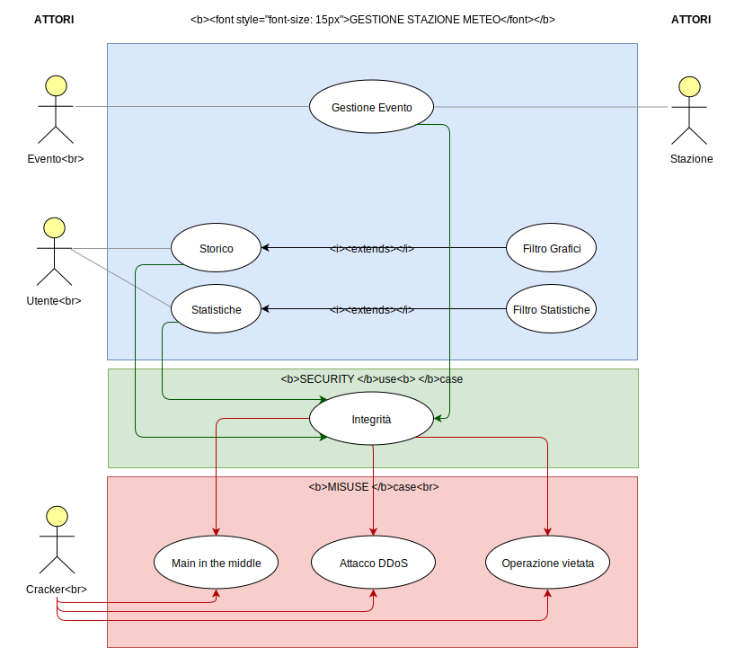

<table>
<tr class="firstRow"><td colspan=4><b>Caso d'uso:</b> integrità</td> </tr>
<tr><td colspan=4><b>Percorso del caso d'uso:</b> integrità nella trasmissione dei dati un sensore</td> </tr>
<tr><td colspan=4><b>Misuse case:</b> Man in the middle </td></tr>
<tr><td colspan=4><b>Rischi alla sicurezza:</b> Un malintenzionato può modificare i dati inviati da una stazione remota prima che arrivino al server </td></tr>
<tr><td colspan=4><b>Precondizioni:</b> L'hacker attaccante può intercettare i dati e modificarli, per poi ritrasmetterli al server</td> </tr>
<tr>
    <td rowspan=2><b>Interazioni dell'utente</b></td>
    <td rowspan=2><b>Interazioni dell'attaccante</b></td>
    <td colspan=2><b>
Requisiti del sistema
</b></td>
    <tr><td><b>Interazioni del sistema</b></td> <td><b>Azioni del sistema</b></td>
</tr>
<tr><td></td><td></td><td>La stazione meteo dovrebbe inviare i dati corretti al server</td><td>Il sistema deve impedire che i dati vengano manomessi da qualcuno senza che l'utente se ne accorga</td></tr>
<tr><td></td><td>L'attaccante intercetta e modifica i dati per poi ritrasmetterli al server</td><td></td><td></td></tr>
<tr><td>L'utente riceve dei dati corrotti</td><td></td><td></td><td>Il sistema rileva la corruzzione da parte dell'attaccante</td></tr>
<tr><td></td><td></td><td>Il sistema dovrebbe notificare all'utente la <i>non</i> correttezza dei dati e provvedere ad invalidare o sospendere la ricezione dati dalla stazione meteo</td><td></td></tr>
<tr><td colspan=4><b>Postcondizioni:</b> Il sistema deve aver notificato all'utente l'accaduto e deve aver bloccato la stazione</td></tr>
</table>

<table>
<tr class="firstRow"><td colspan=4><b>Caso d'uso:</b> integrità</td> </tr>
<tr><td colspan=4><b>Percorso del caso d'uso:</b>Corretto funzionamento del sistema</td> </tr>
<tr><td colspan=4><b>Misuse case:</b>Attacco DDoS </td></tr>
<tr><td colspan=4><b>Rischi alla sicurezza:</b>Un malintenzionato potrebbe tentare di sovraccaricare le risorse del sistema con conseguente malfunzionamento dello stesso</td></tr>
<tr><td colspan=4><b>Precondizioni:</b>Il sistema non può gestire un numero molto elevato di richieste in contemporanea</td> </tr>
<tr>
    <td rowspan=2><b>Interazioni dell'utente</b></td>
    <td rowspan=2><b>Interazioni dell'attaccante</b></td>
    <td colspan=2><b>
Requisiti del sistema
</b></td>
    <tr><td><b>Interazioni del sistema</b></td> <td><b>Azioni del sistema</b></td>
</tr>
<tr><td></td><td>L'attaccante effettua un numero molto alto di richieste al sistema in modo da sovraccaricarlo</td><td></td><td></td></tr>
<tr><td></td><td></td><td></td><td>Il sistema deve bloccare l'attaccante nel caso in cui rilevi un numero molto elevato di tentativi di trasmissione o di richieste</td></tr>
<tr><td></td><td></td><td>Il sistema dovrebbe registrare l'attacco avvenuto per poter poi essere analizzato dall'amministratore</td><td></td></tr>
<tr><td colspan=4><b>Postcondizioni:</b> Il sistema deve aver notificato nei log l'avvenuto</td></tr>
</table>

<table>
<tr class="firstRow"><td colspan=4><b>Caso d'uso:</b> Integrità</td> </tr>
<tr><td colspan=4><b>Percorso del caso d'uso:</b> integrità dei dati salvati dal sistema</td> </tr>
<tr><td colspan=4><b>Misuse case:</b> Operazione vietata</td></tr>
<tr><td colspan=4><b>Rischi alla sicurezza:</b> Un malintenzionato può modificare i dati già salvati sul database, modificando lo storico degli eventi</td></tr>
<tr><td colspan=4><b>Precondizioni:</b> Il sistema ha in memoria dei dati che non possono e non devono essere modificati in quanto invaliderebbero lo storico degli eventi</td> </tr>
<tr>
    <td rowspan=2><b>Interazioni dell'utente</b></td>
    <td rowspan=2><b>Interazioni dell'attaccante</b></td>
    <td colspan=2><b>
Requisiti del sistema
</b></td>
    <tr><td><b>Interazioni del sistema</b></td> <td><b>Azioni del sistema</b></td>
</tr>
<tr><td></td><td>L'attaccante tenta di modificare i dati salvati dal sistema</td><td></td><td></td></tr>
<tr><td></td><td></td><td></td><td>Il sistema deve impedire che i dati vengano manomessi una volta memorizzati</td></tr>
<tr><td></td><td></td><td>Il sistema dovrebbe registrare il tentativo di attacco per poter poi essere analizzato dall'amministratore</td><td></td></tr>
<tr><td colspan=4><b>Postcondizioni:</b> Il sistema deve verificare la correttezza dei dati memorizzati</td></tr>
</table>

### Requisiti di Protezione
Dopo l'analisi dei rischi, vi è quindi il bisogno di nuovi requisiti riguardanti la protezione del sistema e dei dati:
1. Un sistema di log che permetta all'amministratore di visualizzare tutte le azioni avvenute sul sistema, registrate in modo permanente; nel caso di attacchi esterni come ManInTheMiddle, DDoS o di tentativi di corruzione dei dati, è possibile risalire alla causa e analizzare nel dettaglio quanto avvenuto. I log verranno visualizzati e gestiti con un editor di testo esterno, non rilevante e non implementato per il progetto.
2. I dati sismici trasmessi in remoto devono essere protetti da attacchi di tipo man in the middle, eventualmente adottando una cifratura dei dati in transito.

## Interfacce grafiche

### Struttura
Il sistema presenta due sezioni principali navigabili senza dover effettuare alcun tipo di registrazione/autenticazione. Una sezione, permette la visualizzazone dei dati meteorologici legati ad una specifica città, fornendo informazioni in tempo reale e grafici storici. L'altra sezione permette invece di visualizzare dei report statistici nazionali o specifici di una città, legati ad un intervallo temporale definito dall'utente.

### Homepage

Questa è la sezione di partenza del sistema; permette di spostarsi nelle due sezioni principali attraverso un form di ricerca per città e un bottone per le statistiche.

Una volta che viene utilizzato il tasto di ricerca:

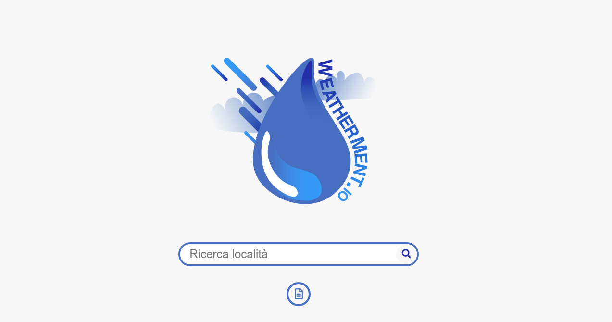

### Vista città

In questa sezione del sistema visualizziamo i dati in tempo reale della città cercata (a destra del nome della città stessa) e a sinistra le varie icone che permettono di visualizzare i grafici dettagliati per ogni singolo tipo di dato.

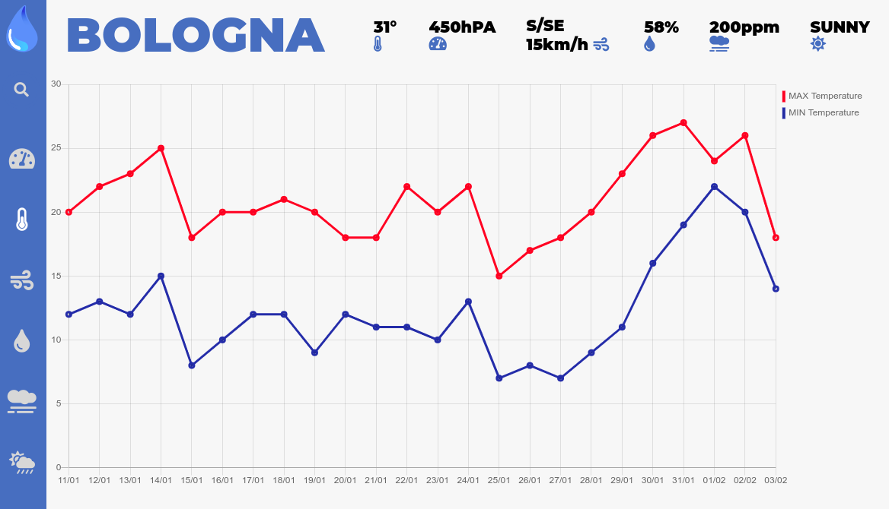

La barra di ricerca, presente anche in questa schermata, che permette di cercare altre città

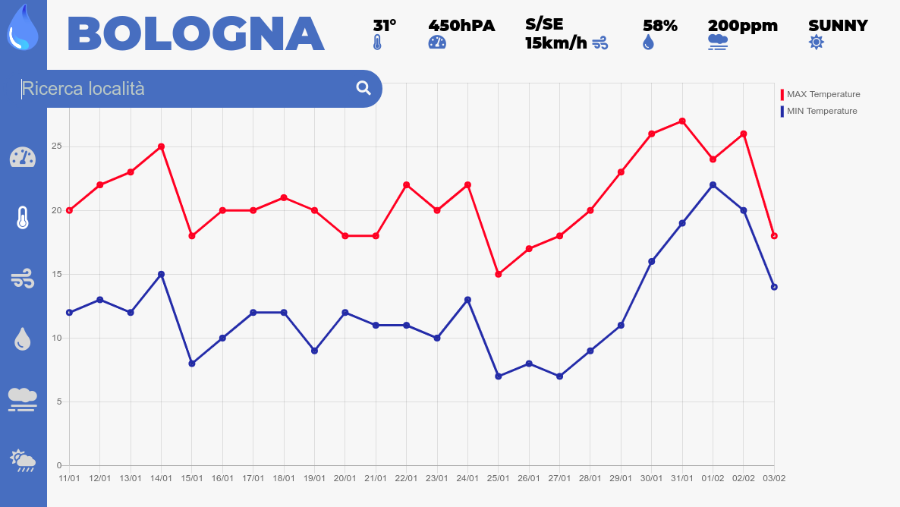

Vi è inoltre la possibilità di evidenziare nel grafico, uno specifico punto di nostro interesse

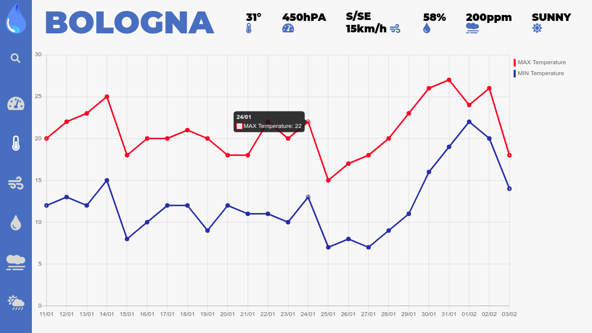

# Analisi del problema
## Analisi del documento dei requisiti
### Analisi delle funzionalità

**Tabella Funzionalità** 

Funzionalità | Tipo | Grado Complessità
|-|-|-
Gestione Eventi | Gestione e memorizzazione dei dati, interazione con l'esterno | Complessa
Scrittura Log | Memorizzazione dati | Semplice
Statistiche | Visualizzazione report generali filtrabili | Semplice
Storico | Visualizzazione eventi filtrabili | Semplice

**Gestione Evento: Tabella Informazioni/ Flusso**

Informazione | Tipo | Livello Protezione/ Privacy | Input/ Oputput | Vincoli
|-|-|-|-|-
Dato sensore Hardware | Semplice | Media | Input | |
Event | Composto | Alta | Output | |
Data | Semplice | Media | Input | |
Ora | Semplice | Media | Input | |
Stazione D'origine | Composto | Media | Input | |

**Scrittura Log: Tabella Informazioni/ Flusso** 

Informazione | Tipo | Livello Protezione/ Privacy | Input/ Oputput | Vincoli
|-|-|-|-|-
IP | Semplice | Alta | Input | |
Azione | Semplice | Alta | Input | |
Ora | Semplice | Media | Input | |
Data | Semplice | Media | Input | |

**Statistiche: Tabella Informazioni/ Flusso** 

Informazione | Tipo | Livello Protezione/ Privacy | Input/ Oputput | Vincoli
|-|-|-|-|-
**Event** composto da: | Composto | Alta | Input | |
Topic | Semplice | Media | Input | Stringa |
Type | Semplice | Media | Input | Stringa |Version | Semplice | Media | Input | Intero maggiore di zero
Payload | Composto | Media | Input | |

**VistaCitta: Tabella Informazioni/ Flusso** 

Informazione | Tipo | Livello Protezione/ Privacy | Input/ Oputput | Vincoli
|-|-|-|-|-
**Event** composto da: | Composto | Alta | Input | |
Topic | Semplice | Media | Input | Stringa |
Type | Semplice | Media | Input | Stringa |Version | Semplice | Media | Input | Intero maggiore di zero
Payload | Composto | Media | Input | |

### Analisi dei vincoli

**Tabella dei vincoli**

Requisito | Categorie | Impatto | Funzionalità
|-|-|-|-
Integrità | Integrità | Rallentamento nella fase di scrittura e di validazione del dato; correttezza del dato assicurata dalla barriera | Gestione Evento, Statistiche, VistaCitta
Efficienza scrittura | Performance | Maggiore efficienza nella fase di scrittura persistente del dato ed un tempo di risposta ridotto | Gestione Evento
Velocità validazione | Performance | Maggiore efficienza nella validazione del dato ed un tempo di risposta ridotto | Gestione Evento
Efficienza stazione meteo | Sistema esterno | Impatto sul sistema nullo; possibilità di elaborare velocemente i dati letti dai sensori |
Rapidità di ricerca | Tempo di risposta | Maggiore efficienza nella fase di fetch dei dati all'interno del database | VistaCitta, Statistiche
Velocità di lettura | Tempo di risposta | Maggiore efficienza nella fase di lettura del dato ed un tempo di risposta ridotto | VistaCitta, Statistiche
Semplicità ed immediatezza nell'utilizzo |  Usabilità | Migliore usabilità da parte dell'utente finale; interfacce grafiche intuitive | VistaCitta, Statistiche

### Analisi delle interazioni

**Tabella maschere**

Maschera | Informazioni | Funzionalità
|-|-|-
Homepage | Pagina iniziale con logo, barra di richerca della località d'interesse e relativo bottone per le statistiche generali | VistaCitta, Statistiche
VistaCitta | Dati in tempo reale filtrabili e grafici degli eventi relativi alla località cercata | VistaCitta
Schermata statistiche | Dati in tempo reale e report filtrabili relativi alla località cercata | Statistiche
 
**Tabella sistemi esterni**

Sistema | Descrizione | Protocollo di interazione | Livello di sicurezza
|-|-|-|-
Stazione meteo | Insieme di sensori e componenti hardware che formano una stazione meteo | La stazione invia al server gli eventi seguendo lo schema di default. Il sistema li convalida e li scrive in modo persistente sul database | Medio; la stazione può subire attacchi esterni sia dal punto di vista software che hardware

## Analisi dei ruoli e delle responsabilità

Ruolo | Responsabilità | Maschere | Riservatezza | Numerosità
-|-|-|-|-|
Utente | Consulta i dati in tempo reale delle stazioni meteo utilizzando i filtri offerti dall'applicazione e il relativo storico | Homepage, VistaCitta, Schermata statistiche | Bassa | Il numero di utenti non è limitato. Dipende dalla scalabilità del sistema

**Utente : Tabella ruolo-informazioni**

Informazione | Tipo di accesso
-|-|
VistaCitta | Lettura
Statistiche | Lettura

## Creazione modello del dominio

Direction: N; NNE; NE; ENE; E; ESE; SE; SSE; S; SSO; SO; OSO; O; ONO; NO; NNO

State: SUNNY; CLOUDY; RAINY; SNOWY

## Architettura logica

### Struttura

#### Diagramma dei package

#### Diagramma delle classi

**ViewHomePage** interroga la VistaCittàController per quanto riguarda la visualizzazione di una città specifica; altrimenti StatisticheController per avere dei report nazionali o della specifica città cercata.  
**ViewCitta** oltre alla visualizzazione specifica della località cercata mostra all'utente i relativi dati in tempo reale.  
**VistaCittaController** filtra per un determinato tipo di evento e per un determinato lasso di tempo.  
**StatisticheController** filtra per città cercata e un determinato intervallo di tempo.

**LogController** scrive dei file di log a seconda delle azioni avvenute sul sistema.  
**TrasmissioneController** si occupa della trasmissione dei dati dalla stazione meteo al server.  
**EventoController** scrive in maniera persistente gli eventi dopo aver effettuato la validazione secondo lo schema predefinito.  
**ProiezioniController** aggrega gli eventi letti da EventoController creando delle proiezioni a seconda degli eventi ricevuti. Le proiezioni così create verranno poi utilizzate da VistaCittaController e da StatisticheController.

### Interazione

#### Diagramma di sequenza: Lettura dati dai diversi sensori

In maniera ciclica e parallela i sensori acquisiscono i dati che vengono poi inoltrati alla stazione meteo. 

#### Diagramma di sequenza: Trasmissione dei dati

I dati ricevuti dai sensori vengono elaborati da **StazioneController** il quale, se verifica un cambiamento, crea un evento da trasmettere all'apposito controller. In caso di errori nella trasmissione è previsto un sistema di backup e reinvio di dati per garantire l'integrità di tutti gli eventi.

#### Diagramma di sequenza: Gestione dell'evento

**EventoController** si occupa della validazione dell'evento ricevuto, superato tale controllo provvede alla scrittura persistente dell'evento.

#### Diagramma di sequenza: Proiezione

Il **ProiezioniController** viene notificato [ `notify()` ] della scrittura di un nuovo evento, che subisce un ulteriore elaborazione per creare le diverse proiezioni del dato.

### Comportamento

#### Diagramma di stato Trasmissione

Il seguente diagramma mostra l'algoritmo di reinvio e backup dei dati in caso di erorri di trasmissione.

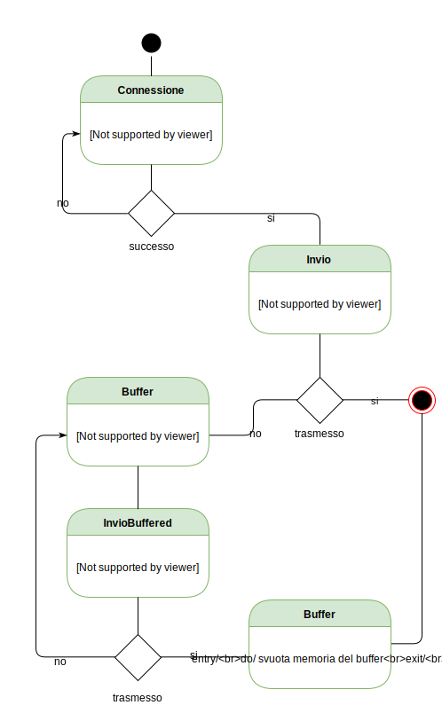

### Piano del Lavoro

Il lavoro di progettazione e di sviluppo è stato suddiviso tra i vari membri del team come segue:

Package | Progetto | Sviluppo
-|-|-|
InterfaceUtente | Foglia, Forcellese, Pomponii | Forcellese
VistaCitta | Foglia, Forcellese  | Pomponii
Statistiche | Foglia, Forcellese | Forcellese, Pomponii
Proiezioni | Foglia, Forcellese, Pomponii | Foglia, Forcellese, Pomponii
Log | Pomponii | Pomponii
GestioneEvento | Foglia, Forcellese, Pomponii | Foglia, Forcellese, Pomponii
Trasmissione | Foglia, Forcellese, Pomponii | Pomponii
Dominio (*Records, Event, WeatherNow) | Foglia, Forcellese, Pomponii | Foglia, Forcellese, Pomponii

Dopo aver valutato attentamente la mole di lavoro richiesta, i tempi previsti sono i seguenti:
-   Progettazione: 3 settimane circa.
-   Sviluppo dei vari package: entro 1/2 settimane dalla fine della progettazione.
-   Test unitari e testing totale del sistema: entro una settimana dallo sviluppo di tutti i package.

### Piano di Collaudo 

Per garantire il corretto funzionamento del sistema sono necessari diversi test unitari che permettono di verificare il corretto funzionamento delle diverse parti che lo compongono.

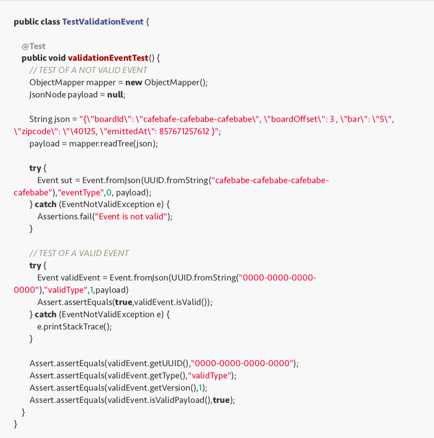

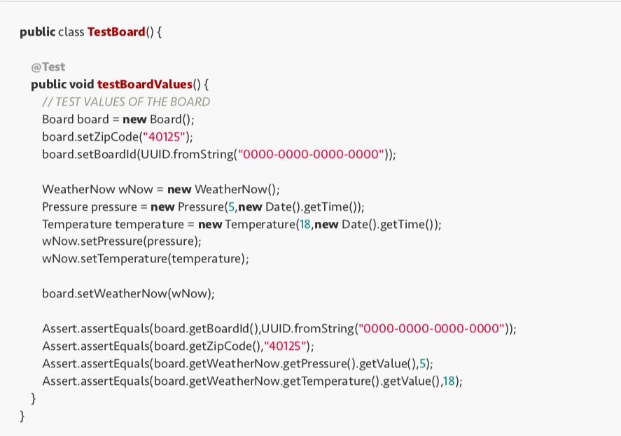

# Progetto

## Progettazione architetturale

### Requisiti non funzionali

Dall'analisi dei requisiti non funzionali sono emersi i seguenti requisiti:
-   Efficienza scrittura
-   Efficienza stazione meteo	
-   Integrità
-   Rapidità di ricerca	
-   Semplicità ed immediatezza nell'utilizzo
-   Velocità di lettura
-   Velocità validazione

L'efficienza del sistema è estremamente importante nonchè il suo punto di forza; avendo una grande mole di dati da ricevere e processare, è necessario garantire delle performance elevate per poter permetterne la fluidità.  Essendo il sistema in grado di determinare quando un evento si è verificato, la quantità di dati trasmessa sulla rete può essere ridotta al minimo indispensabile. La comunicazione può anche avvenire in maniera più rapida a discapito della sicurezza e dell'integrità del dato, in quanto esso stesso non è sensibile e non necessita una forte protezione. Per quanto riguarda la rapidità di ricerca, anch'esso è un requisito abbastanza importante per permettere una fruizione rapida ed efficace da parte dell'utente. Il sistema inoltre deve riuscire a validare gli eventi letti dai sensori senza fare da *collo di bottiglia* alle prestazioni generali.  Per garantire una buona performance a livello di persistenza, e per permettere l'utilizzo di alcune funzioni che riducono i tempi di sviluppo software (in quanto già predisposto), viene utilizzato un database *PostgreSQL* che permette l'invio asincrono di funzioni di notifica tra vari componenti del sistema.  La stazione meteo non è legata ad uno specifico hardware, così come i sensori non sono necessariamente ristretti a quelli descritti nell'analisi dei requisiti; data la flessibilità del sistema è possibile in versioni future aggiungere facilmente nuovi tipi di sensori e di dati letti.

### Scelta dell'architettura

Il sistema prevede un'architettura client/server a tre livelli, distribuita su più server e su più layer di persistenza. Si utilizzano diversi pattern architetturali: il primo, per la ricezione, registrazione e gestione degli eventi è un *event driven architecture*, mentre nella seconda parte client/server viene utilizzato un pattern MVP (Model View Presenter).

Un utente (client) può connettersi ad un servitore tramite l'utilizzo del protocollo http, dato che sulla piattaforma non vi sono dati sensibili da proteggere. Inoltre la fruizione dei dati non è vincolata ad una fase di autenticazione, infatti l'utente può accedere liberamente a tutti i contenuti che il sito mette a disposizione.

Il server delegato alla gestione degli eventi comunica in modo sicuro tramite l'utilizzo di TLS con la stazione meteo, per evitare possibili casi di attacco esterno e non è direttamente accessibile dall'utente finale.   Il server delle proiezioni invece comunica tramite chiamate http con il cliente, inviando i dati che si vogliono visualizzare letti direttamente dal layer di persistenza.

Il sistema si basa su più database , la persistenza avviene su di un database postgreSQL, adibito alla sola scrittura dei dati provenienti dalle diverse stazioni.
Gli altri database sono generati a partire dalle proiezioni del dato per consentire una maggiore facilità di utilizzo nella fase di aggregazione.

#### Architettura del sistema:

## Considerazioni sulla sicurezza relative alle tecnologie utilizzate

Dopo aver effettuato l'analisi del sistema, le vulnerabilità tecnologiche principali sono legate alla trasmissione del dato e alla persistenza. 

### Database

<table>
  <tr class="firstRow"><td><b>Rischio</b></td><td>Accesso al database non autorizzato e alterazione dei dati</td></tr>
  <tr><td><b>Descrizione</b></td><td>L'accesso al database, sebbene protetto da password, può essere forzato da un possibile attaccante in diversi modi. Se un malintenzionato dovesse ottenere l'accesso al database, potrebbe modificare, cancellare i dati persistenti su tutto il sistema.</td></tr>
  <tr><td><b>Possibili soluzioni</b></td><td><li>Una possibile soluzione al problema è la cifratura dei dati che renderebbe illeggibile il contenuto ad un possibile attaccante. PostgreSQL ha un supporto nativo sia alla crittografazione della comunicazione tramite protocollo <b>SSL</b>, sia alla criptazione del dato attraverso criptazione <b>simmetrica</b> e <b>asimmetrica</b>, rendendo di fatto l'intero database più sicuro. <li>Un altra possibile soluzione, che non esclude la precedente, è l'utilizzo di alcune meccaniche di <b>log</b> fornite da PostgreSQL per poter analizzare i vari tentativi di intrusione. <li> L'alterazione dei dati inoltre può essere controllata con backup periodici e controlli di integrità.</td></tr>
</table>

### Trasmissione remota dei dati
Per rendere sicura una trasmissione remota dei dati sismici dalle stazioni meteo al sistema, è necessario creare una connessione sicura su cui operare. Questo canale deve garantire uno standard di qualità di servizio e sicurezza, per evitare una possibile lettura o corruzione dei dati in transito; questo avviene implementando il protocollo SSL TLS. 

## Progettazione di Dettaglio
### Struttura

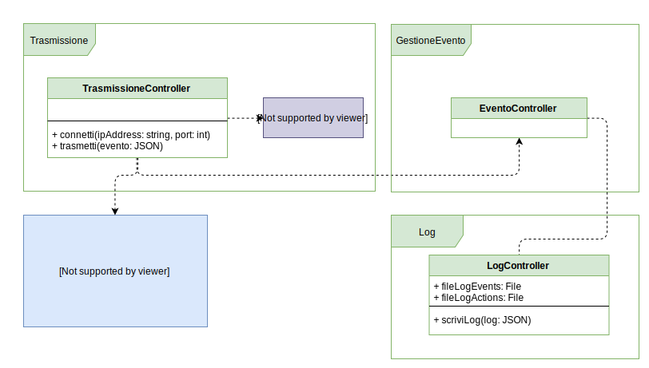
#### Trasmissione 
- **TrasmissioneController**: si occupa della trasmissione dei dati letti dalla stazione all'EventoController. Il metodo `trasmetti` serializza ed invia l'evento in formato JSON. Il metodo `connetti` apre una connessione con l'indirzzo e la porta specificati.   Nel caso in cui la connessione non dovesse andare a buon fine, viene lanciata una eccezione *ConnectionFailed*.   Implementa l'interfaccia StazioneInterface che permette la lettura dei sensori e la verifica dei cambiamenti del dato, andando quindi ad inviare un evento solo nel caso in cui esso rappresenti una variazione.

#### Log
- **LogController**: si occupa della scrittura dei log di tutto il sistema, include quindi tutte le interazioni da parte dell'utente e tutte le interazioni da parte della stazione. Il metodo `scriviLog` permette di scrivere su file a partire da un JSON, che sarà formattato a seconda del log come specificato nel capitolo dedicato successivamente.

Dopo un'attenta riflessione, sono stati apportati dei cambiamenti rispetto alla struttura dei package definiti nella fase di analisi. I due controller, **VistaCittaController** e **StatisticheController**, sono stati ritenuti superflui e sono stati accorpati in **ProiezioniController**. Questo per permettere di mantenere la logica di business in un unico posto, non dovendo così definire più controller per la lettura e la scrittura dei dati. Inoltre, utilizzando un repository pattern, non è necessario specificare come sia effettivamente l'implementazione, che può utilizzare diversi approcci (DAO etc..). 

#### GestioneEvento
- **EventoController**: questo controller agisce da tramite tra la trasmissione della stazione meteo (TrasmissioneController) e il controller delle proiezioni. È un componente fondamentale del sistema in quanto gestisce la validazione degli eventi attraverso Validator e, tramite il repository pattern, delega la persistenza degli eventi all'EventoRepository. A differenza della fase di analisi non abbiamo più bisogno del meodo notify per comunicare con ProiezioniController in quanto per scelte tecnologiche si utilizza il DBMS PostrgreSQL che fornisce l'apposita funzione standard `notify()`.
- **Validator**: si occupa della validazione del payload, facendo riferimento al JSON Schema relativo al tipo di evento ricevuto. In caso di evento malformato o non valido lancia una eccezione *InvalidEvent*.
- **EventoRepository**: attraverso il repository pattern viene disaccoppiata la logica di business e la logica di accesso ai dati; l'EventoRepository quindi permette la lettura e la scrittura degli eventi sulla persistenza. Per farlo implementa l'interfaccia EventoRepositoryInterface che definisce esattamente come salvare, trovare e filtrare gli eventi interfacciandosi direttamente con il DB. I metodi `find` e `filter` servono per recuperare degli eventi avvenuti in passato nel caso in cui si voglia generare una nuova proiezione da zero, in quanto la funzione di notifica dell'EventoController viene richiamata solo una volta, appena ricevuto il dato. Non espone, a differenza di un generico repository pattern, tutti i metodi CRUD (Create, Read, Update, Delete) per ogni entità del modello, in quanto la persistenza degli eventi viene gestita in APPEND-ONLY e quindi non può per nessun motivo permettere la modifica o l'eliminazione dei dati.

#### Proiezioni
- **ProiezioniController**: si occupa della creazione e dell'aggiornamento delle proiezioni attraverso il DataRepository a partire dalle notifiche degli eventi ricevuti dall'EventoController. Il metodo `gestisciEvento`, dato l'evento in input, lo trasforma a seconda del tipo dell'evento in una classe specifica.
- **DataRepository**: è un componente fondamentale del sistema; sempre attraverso il repository pattern, permette di separare la business logic dall'accesso ai dati, permettendo inoltre di poter avere diverse implementazioni a seconda del caso d'uso. Essendo l'unico responsabile della persistenza delle proiezioni, viene utilizzato sia in scrittura, in quanto permette di creare ed aggiornare le proiezioni, sia in lettura poichè viene utilizzato direttamente dalle interfacce utente. Implementa un numero di interfacce pari al numero di proiezioni di cui il sistema ha bisogno; proprio per questo motivo il repository pattern è facilmente mantenibile ed espandibile nel futuro. Ogni interfaccia quindi espone i metodi per la scrittura e la lettura del dato a seconda di come esso è definito nel DB. I metodi `save` di ogni interfaccia consentono la scrittura permanente del dato, mentre i vari metodi `get` permettono di recuperare i dati compresi in un certo intervallo temporale dato un detterminato zipCode.

### Diagrammi di Dettaglio

#### Diagramma di dettaglio - Homepage

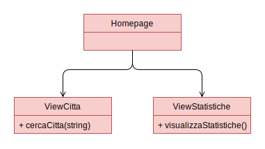

Nel diagramma sopra rappresentato, vengono evidenziate tutte le interfacce disponibili riguardanti la homepage. Nella schermata iniziale non vengono mostrati dati all'utente. Le uniche funzioni esposte sono: la possibilità di cercare una città e visualizzarne i suoi dettagli, oppure avere accesso ad un report nazionale.

#### Diagramma di dettaglio - ViewCitta

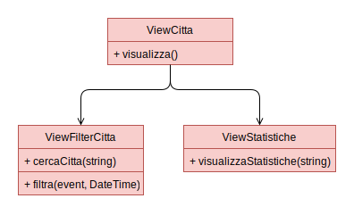

Nel diagramma sopra rappresentato, vengono evidenziate tutte le interfacce disponibili riguardanti la vista città.
Nello specifico verrà mostrato all'utente una situazione real-time ed un grafico relativo alla località cercata. Tale grafico può mostrare diversi dati in base alle scelte effettuate attraverso un opportuno filtro.   Tramite questa interfaccia è possibilie accedere anche al report della città cercata in precedenza.

#### Diagramma di dettaglio - ViewStatistiche

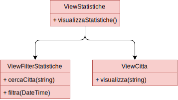

Nel diagrama sopra rappresentato, vengono evidenziate tutte le interfacce disponibili riguardanti la vista statistiche. Tale vista offre all'utente un report annuo, il quale può essere nazionale o della località cercata, riguardo tutti i dati raccolti. Inoltre attraverso un opportuno filtro è possibile cambiare l'intervallo di tempo di cui si vuole avere il report.   Tramite questa view è possibile accedervi alla vista città per avere dei grafici più dettagliati della città cercata in precedenza.   Nel caso si sta visualizzando il report nazionale, tale grafico, mostrerà un report mese per mese dell'evento selezionato.

## Interazione

### Comportamento
Come nella parte di analisi del problema, non è stato necessario descrivere entità con uno stato o diagrammi di interazione specifici; ciononostante si è deciso di riportare il diagramma di interazione del controllo e della validazione di un evento, a partire dai sensori della stazione meteo alla scrittura persistente effettuata dal server.

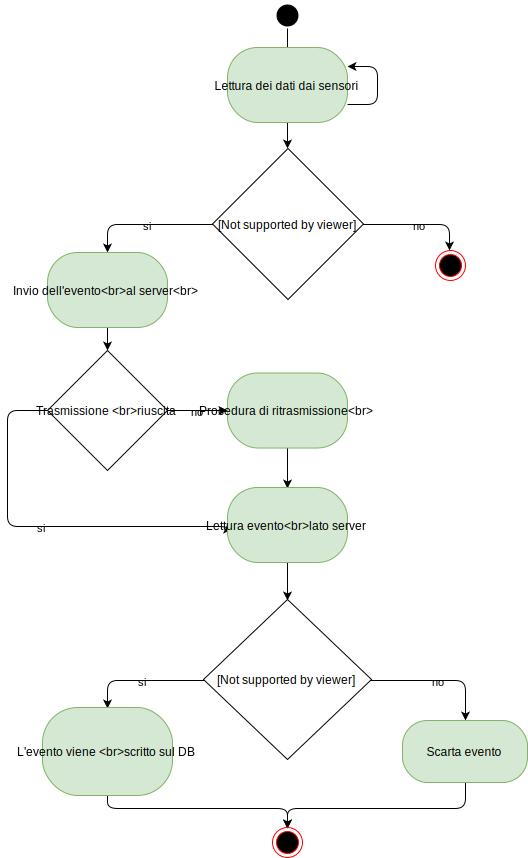

## Persistenza

### Diagramma ER - Event Driven persistence

#### Scelte progettuali

Sono state applicate diverse selte progettuali che, seppur aumentando la complessità della persistenza, permettono una ricostruzione per stazione meteo temporalmente corretta e garantiscono l'integrità degli eventi anche solo grazie al modo in cui essi sono modellati. Per questo motivo invece di ricostruirla tramite data (timestamp) necessitiamo di una sequenza numerica *gapless* che identifichi gli eventi temporalmente nel momento in cui vengono salvati. La tabella TopicHeight identifica per ogni singolo topic la lista di eventi registrati nell'ordine in cui essi vengono scritti. Inoltre ogni evento inviato da una stazione meteo, ha nel suo payload un *numero incrementale* (boardOffset) che permette di avere una sequenza corretta per tale scheda. Per quanto rigurda invece la tabella Revision, nell fase di validazione dei dati, si fa riferimento allo schema definito per quella version. La tabella TypeRevision invece serve a tenere traccia dell'ultima version relativa ad ogni Type. Inoltre l'intera persistenza del sistema è stata progettata in modo da poter essere adattiva a nuovi tipi di dato (nuovi event di type diversi, o nuovi event di topic diversi) senza dover rimodellare l'intero schema.

Il seguente diagramma ER rappresenta le entità e le relazioni appartenenti alla persistenza degli eventi.

**Entità:**
- Topic: ogni topic è identificato da un ID (primary key) e presenta un solo attributo, il nome. Tale coppia deve essere unica all'interno del sistema.
- Type: ogni type è identificato da un ID (primary key) e presenta un solo attributo, il nome. La coppia name e chiave esterna che riferisce l'ID della tabella topic devono essere univoci all'interno del sistema.
- Revision: ogni revision è identificata da un ID (primary key) e presenta l'attributo version, il quale identifica il numero di versione e, l'attributo schema di tipo JSON. La coppia version e chiave esterna che riferisce l'ID della tabella Type devono essere univoci all'interno del sistema.
- TopicHeight: tiene traccia del numero di eventi relativi a quel topic, la primary key è rappresentata dalla chiave esterna che riferisce l'ID della tabella Topic.
- TypeRevision: tiene traccia dell'ultima version per ogni type, la primary key è data dalla chiave esterna che riferisce l'ID della tabella Type.
- Event: rappresenta l'evento emesso dalla stazione, la primary key viene identificata dalla coppia topicHeight e dalla Foreign Key del topic relativo all'evento scritto. Inoltre abbiamo l'attributo receivedAt il quale indica in formato timestamp il momento in cui è stata scritta la riga sul database e l'attributo Payload.

Gli ID (primary key e non) sono degli interi AUTO-INCREMENT.

**Relazioni:**
- Topic (1..1) - (1..N) Type: ogni type riferisce un solo Topic; un Topic può riferire da 1 ad N Type.
- Type (1..1) - (1..N) Revision: ogni Revision riferisce un solo Type; un Type può riferire da 1 ad N Revision.
- TopicHeight (1..1) - (1..N) Topic: ogni Topic riferisce un solo TopicHeight; un TopicHeight può riferire da 1 ad N Topic.
- TypeRevision (1..1) - (1..N) Type: ogni Type riferisce un solo TypeRevision; un TypeRevision può riferire da 1 ad N Type.
- Event (0..N) - (1..1) Topic: ogni Event riferisce un solo Topic; un Topic può riferire da 0 ad N Event.
- Event (0..N) - (1..1) Type: ogni Event riferisce un solo Type; un Type può riferire da 0 ad N Event.
- Event (0..N) - (1..1) Revision: ogni Event riferisce un solo Revision; un Revision può riferire da 0 ad N Event.

### Diagramma ER - Proiezioni

#### Scelte progettuali 
Utilizzando un sistema ad eventi si definisce una tabella per ogni proiezione che si vuole utilizzare nel sistema. In questo modo il DB così strutturato è facilmente espandibile a nuovi tipi di proiezioni.

Il seguente diagramma ER rappresenta le entità e le relazioni appartenenti alla persistenza delle proiezioni.

**Entità**
- WeatherNow: zipCode rappresenta la primary key della tabella in questione, la quale espone all'utente i relativi attributi in tempo reale.
- WindRecords: raccoglie tutti gli eventi inerenti alla velocità e direzione del vento, i cui valori sono espressi dall'attributo speed per quanto riguarda la velocità e dalla chiave esterna per quanto riguarda la direzione. L'attributo emittedAt è dato dalla scheda che ha registrato il cambiamento, in formato timestamp. La primary key è data dallo zipCode.
- WeatherState: raccoglie tutti gli eventi inerenti allo stato del meteo, il cui valore viene espresso dalla chiave esterna. L'attributo emittedAt è dato dalla scheda che ha registrato il cambiamento, in formato timestamp. La primary key è data dallo zipCode.
- PollutionRecords: raccoglie tutti gli eventi inerenti all'inquinamento atmosferico, il cui valore viene espresso dall'attributo CO2. L'attributo emittedAt è dato dalla scheda che ha registrato il cambiamento, in formato timestamp. La primary key è data dallo zipCode.
- UmidityRecords: raccoglie tutti gli eventi inerenti all'umidità presente nell'aria, il cui valore viene espresso dall'attributo umidity. L'attributo emittedAt è dato dalla scheda che ha registrato il cambiamento, in formato timestamp. La primary key è data dallo zipCode.
- TemperatureRecords: raccoglie tutti gli eventi inerenti alla temperatura ambientale, il cui valore viene espresso dall'attributo temperature. L'attributo emittedAt è dato dalla scheda che ha registrato il cambiamento, in formato timestamp. La primary key è data dallo zipCode.
- WeatherState: è una tabella di dettaglio dove, attraverso l'attributo state, vengono espressi tutti i possibili stati.
- WindDirection: è una tabella di dettaglio dove, attraverso l'attributo direction, vengono espresse tutte le possibili direzioni del vento.

Gli zipCode (primary key e non) sono delle stringhe composte da 5 caratteri.

**Relazioni**
- WeatherNow (0..N) - (1..1) WeatherState: ogni WeatherNow riferisce un solo WeatherState; un WeatherState può riferire da 0 ad N WeatherNow.
- WeatherNow (0..N) - (1..1) WindDirection: ogni WeatherNow riferisce un solo WindDirection; un WindDirection può riferire da 0 ad N WeatherNow.
- WindRecords (0..N) - (1..1) WindDirection: ogni WindRecords riferisce un solo WindDirection; un WindDirection può riferire da 0 ad N WindDirection.
- WeatherStateRecords (0..N) - (1..1) WeatherState: ogni WeatherStateRecords riferisce un solo WeatherState; un WeatherState può riferire un solo WeatherStateRecords.

### Formato del file di log

Il file di log degli eventi deve contenere gli eventi che avvengono nelle componenti del sistema che si occupano di ricevere e salvare gli eventi, per le ragioni di sicurezza discusse nelle sezioni precedenti. Il file è formato in questo modo:

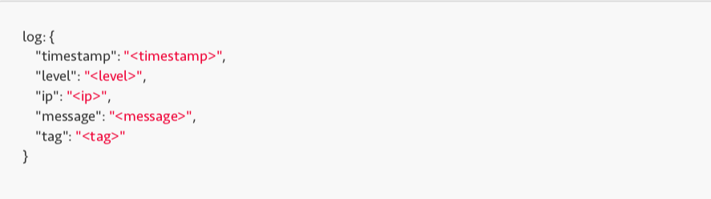

Il file di log relativo alle proiezioni visualizzate dagli utenti è così composto:

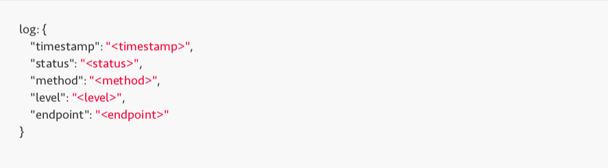

#### Protezione dei file di log

I file di log possono essere crittografati per avere una maggiore sicurezza nel caso in cui un attaccante riesca ad accedervi, non potendo ottenere quindi informazioni. Questo influisce in modo abbastanza significativo sulle performance del sistema, quindi a seconda dell'esigenza può essere abilitata o meno. Vengono inoltre eseguiti backup periodici in un server remoto in maniera da garantirne la disponibilità anche dopo molto tempo.

### Progettazione del collaudo

Partendo dal piano di collaudo, sono stati implementati, dei nuovi test.
Lo scopo di questi test è la verifica del corretto funzionamento delle parti del sistema. Qui di seguito sono riportati soltanti alcuni dei principali test.

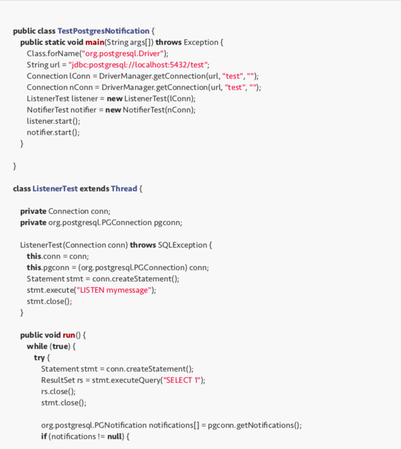

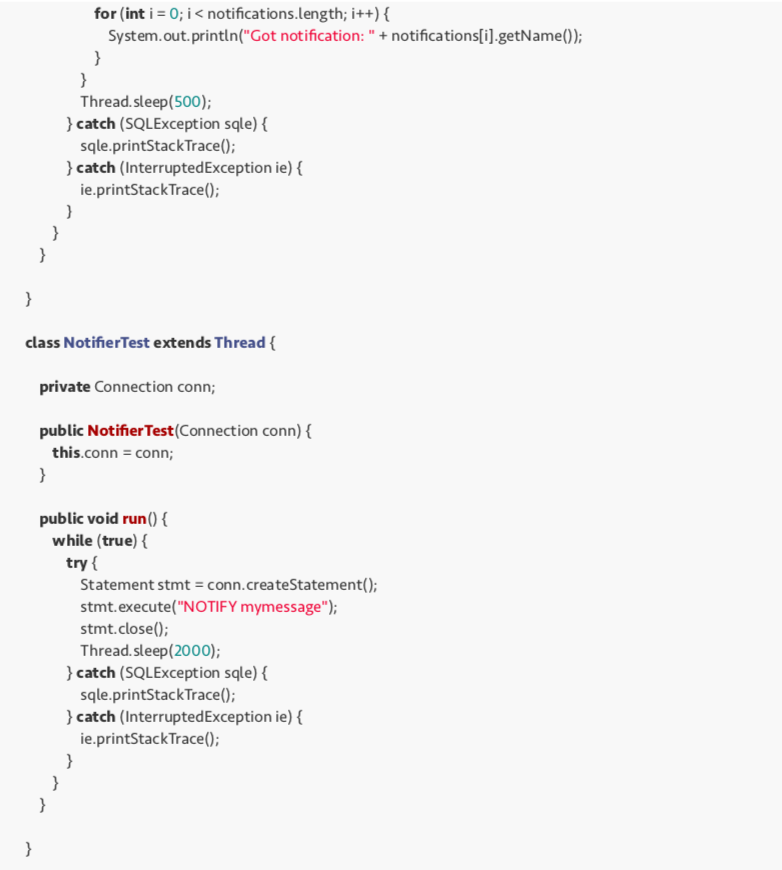

Qui di seguito sono riportati i test per la REST API.
I test eseguono delle chiamate HTTP per testare il corretto funzionamento delle proiezioni

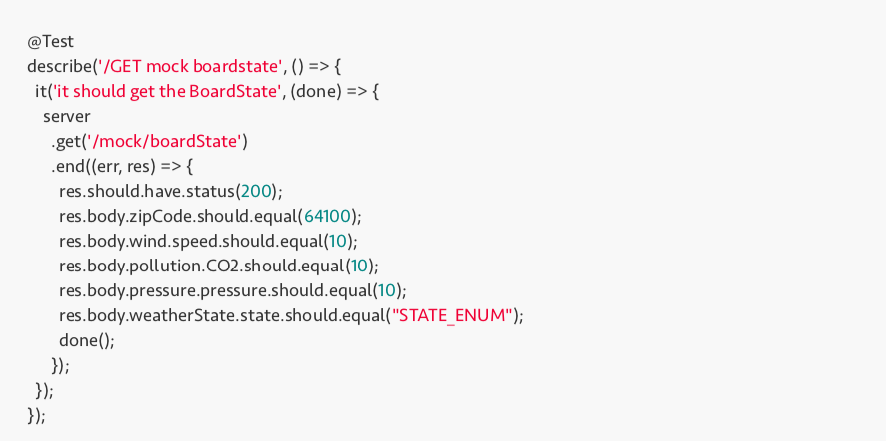

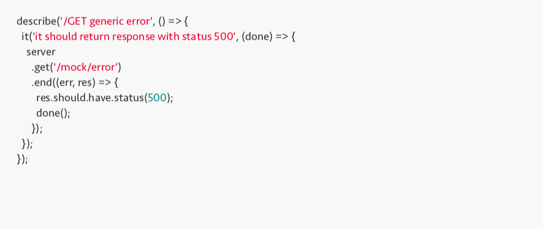
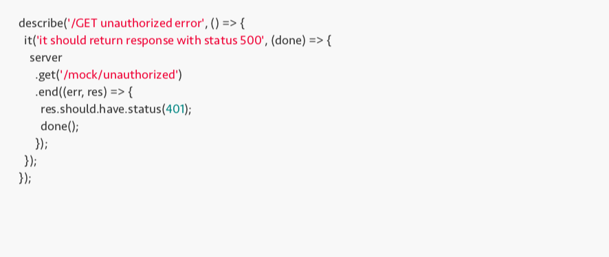

# Deployment

## Artefatti

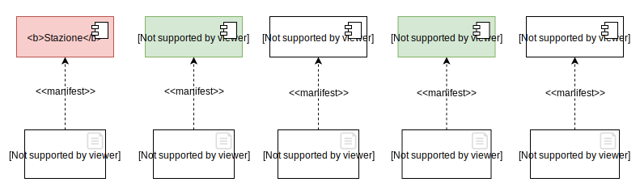

## Deployment-type Level
Di seguito il diagramma di deployment fisico nel quale sono indicati su quali nodi fisici sono allocate le diverse parti del sistema. **Proiezioni Server** e **Proiezioni DBMS** possono essere replicati e distribuiti, a seconda delle esigenze. Ad esempio, si può pensare ad una soluzione dove per ogni tipo di proiezioni vi sia un server dedicato, in modo tale da ottimizzare e partizionare lettura e scrittura, rendendo di fatto tutto il sistema più performante.

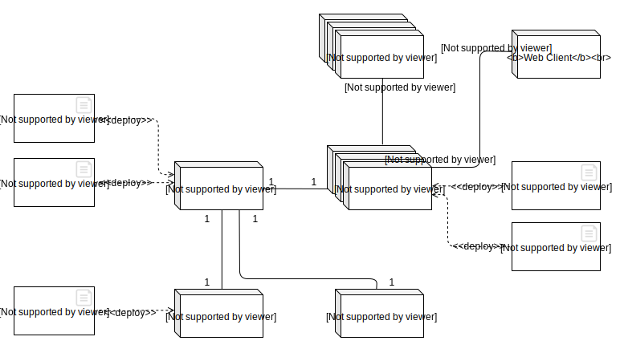